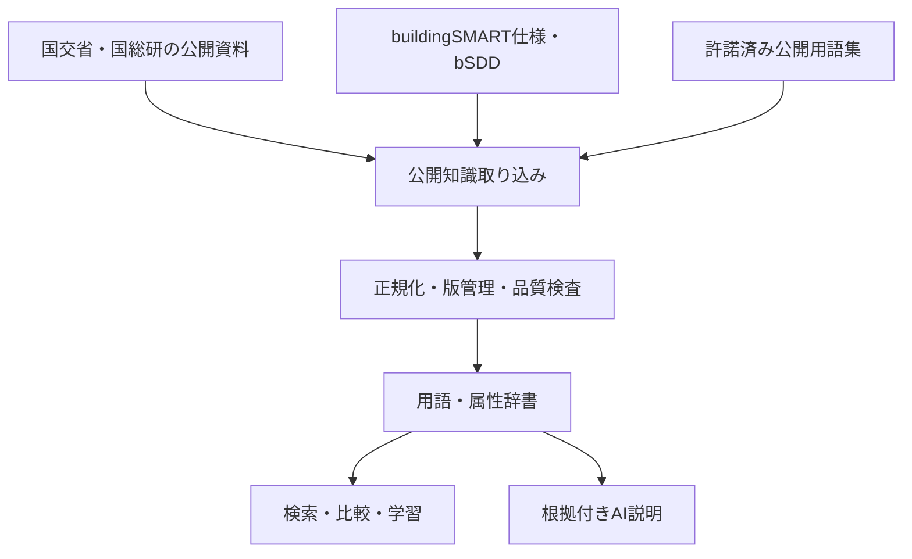
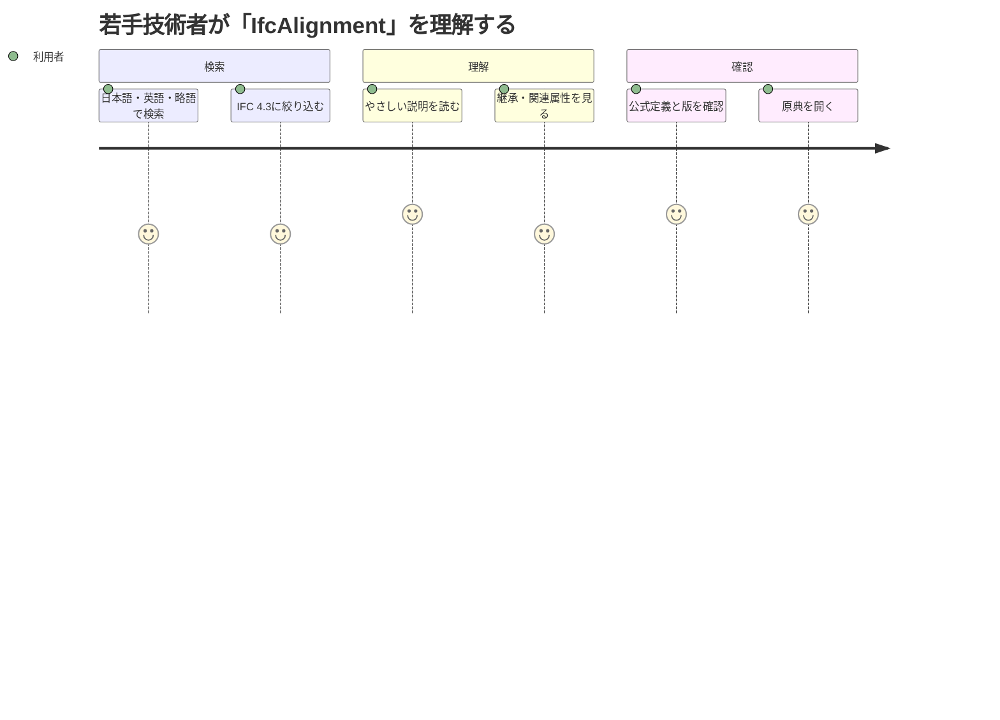
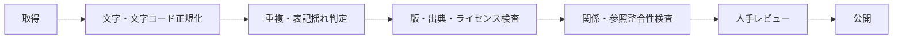
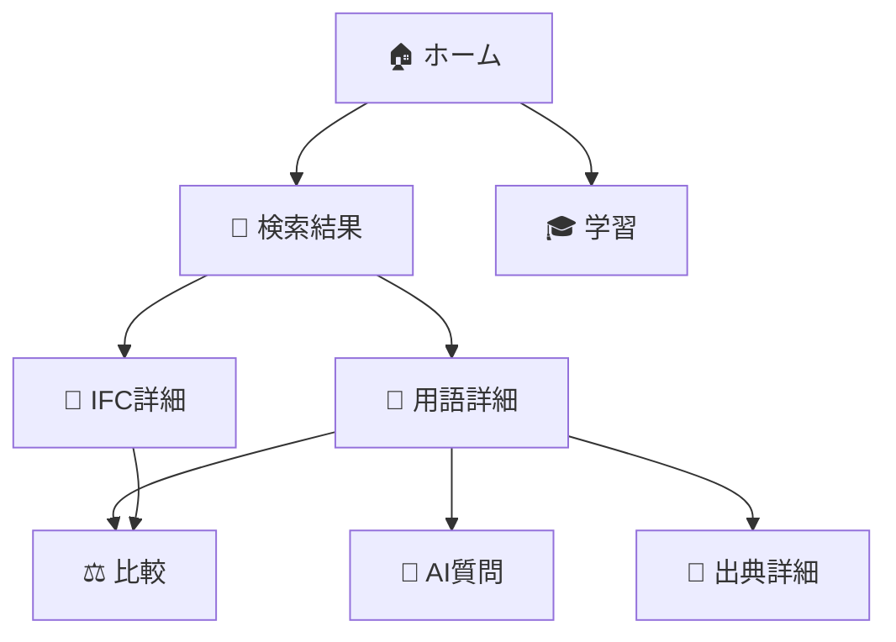
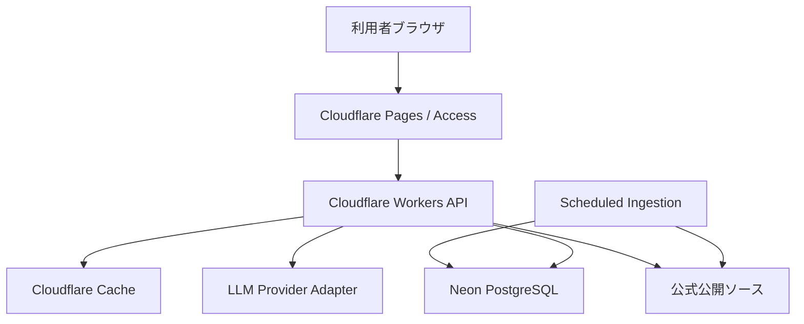
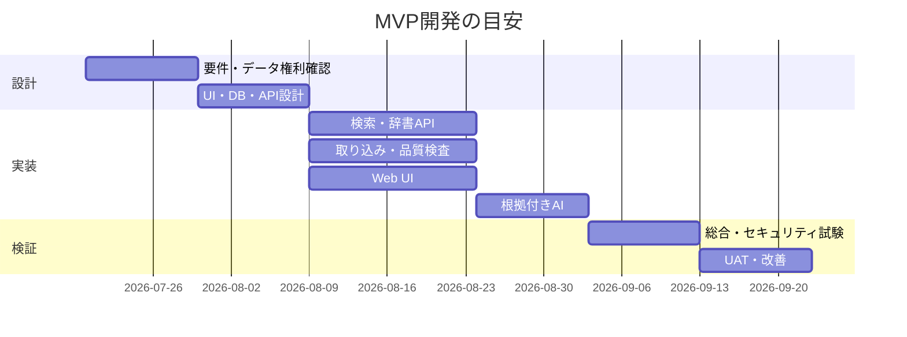

# Open BIM/CIM Dictionary Assistant 要件定義書

> 🧭 openBIM/CIMの用語・属性・公開仕様を、根拠付きで検索・学習・比較できる辞書型Webシステム

| 項目 | 内容 |
| --- | --- |
| 日本語名 | **openBIM/CIM 用語・属性辞書アシスタント** |
| 英語名 | **Open BIM/CIM Dictionary Assistant** |
| リポジトリ候補 | `Open-BIM-CIM-Dictionary-Assistant` |
| 文書種別 | 要件定義書 |
| 版 | 1.0.0 |
| 作成日 | 2026-07-18 |
| 想定開発基盤 | Claude Code on Linux / GitHub / Cloudflare / Neon PostgreSQL |
| データ方針 | 公開仕様・公開API・公開資料・サンプルデータのみ。会社資産・社内情報は扱わない |

---

## 1. 📘 プロジェクト概要

### 1.1 背景

BIM/CIM、openBIM、IFC、属性情報、プロパティセット等は、規格・版・発行主体ごとに用語の粒度や意味が異なる。若手技術者や非専門者は、複数の公開仕様書を横断し、対象用語がどの版・分野・工程に適用されるかを判断しなければならない。

国土交通省は2026年3月時点のBIM/CIM関連基準要領を公開しており、buildingSMARTはIFC、bSDD、IDS、BCF等の標準・サービスを公開している。本システムはそれらを検索可能な知識単位へ整理し、原典への導線を保った説明を提供する。

### 1.2 目的

- 🔎 BIM/CIM・IFC・属性情報・openBIM関連用語を横断検索する
- 🧩 IFCエンティティ、型、列挙値、属性、Property Set、Quantity Setの関係を理解しやすく示す
- 📚 若手教育と自己学習を支援する
- 🏷️ 組織や案件に依存しない公開辞書として、用語の標準化を支援する
- 🔗 すべての説明から原典、版、取得日時へ戻れるようにする
- 🤖 AIは説明・比較・検索補助に限定し、仕様適合や契約上の判断を断定しない

### 1.3 解決する課題

| 課題 | 本システムによる支援 |
| --- | --- |
| 同じ略語が複数の意味を持つ | 分野・標準・版・出典を併記 |
| PDFやWeb仕様を横断しにくい | 統合検索と絞り込み |
| IFCの継承関係が分かりにくい | 親子関係・関連概念を可視化 |
| 古い要領を参照する恐れ | 有効期間、版、後継資料、最新確認日を表示 |
| AI回答の根拠が不明 | 引用可能な根拠チャンクと原典リンクを必須化 |
| 若手向け説明と技術定義が混在 | 「やさしい説明」と「技術定義」を分離 |

### 1.4 システムの位置づけ

### 1.5 対象外

- IFCモデルの本格的な3D表示・編集
- BIM/CIM成果品の適合性を保証する検査
- 契約図書、設計成果、積算、施工可否の最終判断
- 有償規格本文や再配布権のない資料の全文保存・転載
- 社内文書、案件データ、個人情報、機密情報の登録
- CAD/BIMオーサリングツールの代替

---

## 2. 👥 利用者と利用場面

### 2.1 想定利用者

| 利用者 | 主な目的 | 標準権限 |
| --- | --- | --- |
| 若手技術者 | 用語学習、略語確認、関連概念の把握 | 閲覧者 |
| 現場管理者 | 属性・納品・活用用語の確認 | 閲覧者 |
| 土木技術者・設計者 | IFCクラス、Pset、版差分の調査 | 閲覧者 |
| BIM/CIM担当 | 用語整理、根拠確認、教材作成 | 編集者候補 |
| 研究者 | 公開標準の横断調査 | 閲覧者 |
| IT・DX担当 | データソース・同期・品質の管理 | 管理者 |
| 一般公開利用者 | 公開用語の検索 | 閲覧者 |

### 2.2 代表ユースケース

| ID | ユースケース | 成功条件 |
| --- | --- | --- |
| UC-01 | 用語を全文検索する | 日本語、英語、略語、別名、表記揺れから候補が得られる |
| UC-02 | IFC要素を調べる | 版、エンティティ種別、継承、属性、関連Psetを確認できる |
| UC-03 | 用語同士を比較する | 2～4件を定義、版、出典、関連概念で比較できる |
| UC-04 | AIへ質問する | 回答文ごとに根拠または「根拠不足」が表示される |
| UC-05 | 学習する | 初級・中級・上級の学習カードと確認問題を利用できる |
| UC-06 | 出典を確認する | 原典URL、文書名、版、発行日、参照箇所を確認できる |
| UC-07 | 管理者が更新する | 差分検出、レビュー、公開、ロールバックができる |

---

## 3. 🧭 スコープと段階導入

### 3.1 MVP

- 用語・IFCエンティティ・属性・Pset・Qtoの統合検索
- 日本語／英語／略語／別名検索
- 詳細画面、関連語、継承関係、出典表示
- 情報源、版、ライセンス、取得日時の管理
- 国交省公開資料、buildingSMART IFC 4.3、bSDD公開APIの取り込み
- 根拠付きAI説明（RAG）
- 管理画面での取り込みジョブ、品質警告、承認公開
- CSV/JSONによる公開辞書のエクスポート

### 3.2 Phase 2

- 版差分比較（例：IFC4とIFC4.3）
- IDS概念・要件の検索とやさしい説明
- 学習コース、確認問題、ブックマーク
- 日英用語対応の品質向上
- PWAキャッシュによる限定的オフライン閲覧
- 公開API提供

### 3.3 Phase 3候補

- BCF、IDM、MVD、Validation Serviceの解説拡充
- IFCサンプル断片の安全な表示
- モバイル用「Civil Knowledge Pocket」との連携
- 他の公開土木DXシステムから参照できる共通知識API

---

## 4. 🗂️ 対象知識とデータ方針

### 4.1 知識カテゴリ

| カテゴリ | 例 | 主な出典 |
| --- | --- | --- |
| BIM/CIM一般 | BIM/CIMモデル、詳細度、属性情報 | 国土交通省・国総研 |
| openBIM | IFC、IDS、BCF、bSDD、MVD、IDM | buildingSMART |
| IFCスキーマ | Entity、Type、Select、Enum、Function | IFC公式仕様 |
| IFCプロパティ | Pset、Qto、Property、Quantity | IFC公式仕様・bSDD |
| 分類・辞書 | Classification、Class、Property、Unit | bSDD |
| 国内運用 | 取扱要領、電子納品、積算用属性 | 国土交通省・国総研 |
| 教育用知識 | やさしい説明、例、誤解しやすい点 | 編集・レビュー済み派生情報 |

### 4.2 データ採用基準

1. 発行主体が明確な一次情報を優先する。
2. URL、文書名、版、発行日、取得日時、ライセンスを記録できること。
3. 全文保存・再配布が許諾されない場合は、メタデータ、短い引用、独自要約、参照先のみを保存する。
4. 同一概念でも版が異なる場合は上書きせず、別バージョンとして保持する。
5. 機械翻訳・AI生成説明は公式定義と明確に分離する。
6. 取得失敗や構造変更時に、直前の承認済み版を継続提供できること。

### 4.3 データクレンジング

- Unicode NFC、全角／半角、空白、改行、ハイフンの正規化
- 大文字小文字を無視する検索用キーと、原表記の分離
- `IFC4.3`、`IFC 4.3`等の別名管理
- URL、URI、識別子、版の一意性検査
- 同一出典内の重複、孤立参照、循環参照、不明単位の検出
- AI説明に根拠がない、古い、断定的である場合は公開不可

---

## 5. ⚙️ 機能要件

### 5.1 検索・閲覧

| ID | 要件 | 優先度 |
| --- | --- | --- |
| FR-001 | キーワードによる全文検索 | Must |
| FR-002 | 日本語、英語、略語、別名、識別子による検索 | Must |
| FR-003 | 標準、版、発行主体、カテゴリ、分野で絞り込み | Must |
| FR-004 | 誤字・表記揺れに対する候補提示 | Should |
| FR-005 | 用語詳細に定義、やさしい説明、技術説明、注意点を表示 | Must |
| FR-006 | 原典URL、版、発行日、取得日時、参照箇所を表示 | Must |
| FR-007 | 関連語、上位語、下位語、同義語、対義・混同語を表示 | Must |
| FR-008 | 2～4件の比較表を生成 | Should |
| FR-009 | 安定URLとコピー可能な引用情報を提供 | Should |
| FR-010 | 検索結果ゼロ時に候補語・関連カテゴリを提示 | Must |

### 5.2 IFC・属性辞書

| ID | 要件 | 優先度 |
| --- | --- | --- |
| FR-101 | IFCスキーマ版を明示 | Must |
| FR-102 | Entity、Type、Enum、Select等の種別を表示 | Must |
| FR-103 | 継承元・派生先を表示 | Must |
| FR-104 | 明示属性・派生属性・逆属性を区別 | Must |
| FR-105 | Pset、Qto、列挙値、データ型、単位を表示 | Must |
| FR-106 | bSDDのDictionary、Class、Property、URIを参照 | Must |
| FR-107 | インフラ分野のIFC 4.3概念を優先表示 | Must |
| FR-108 | 版をまたぐ差分を表示 | Could（Phase 2） |

### 5.3 AIアシスタント

| ID | 要件 | 優先度 |
| --- | --- | --- |
| FR-201 | 自然文質問を検索条件へ変換 | Must |
| FR-202 | 検索取得した根拠だけを使って回答 | Must |
| FR-203 | 回答に出典番号と原典リンクを付与 | Must |
| FR-204 | 根拠不足時は推測せず不足を明示 | Must |
| FR-205 | 初心者向け／技術者向けの説明レベル切替 | Should |
| FR-206 | 仕様適合・契約判断を断定しない注意書き | Must |
| FR-207 | プロンプトインジェクションを含む取得文を命令として扱わない | Must |
| FR-208 | 回答と参照チャンクの追跡IDを記録 | Must |

### 5.4 学習支援

- 用語カード、関連語マップ、3問程度の確認問題
- 初級／中級／上級の難易度
- 「よくある誤解」と「実務で確認すべき点」の表示
- 正誤判定では公式定義またはレビュー済み教材を根拠とする
- 個人の成績・履歴はMVPでは端末内保存を基本とする

### 5.5 管理・データ運用

| ID | 要件 | 優先度 |
| --- | --- | --- |
| FR-301 | データソース台帳の登録・停止 | Must |
| FR-302 | 定期・手動取り込み | Must |
| FR-303 | 差分、削除候補、破壊的変更の検出 | Must |
| FR-304 | Draft → Review → Published → Archivedの状態管理 | Must |
| FR-305 | 承認者と承認時刻の監査記録 | Must |
| FR-306 | 公開版のロールバック | Must |
| FR-307 | 取り込み・検索・AI利用の運用メトリクス | Must |
| FR-308 | CSV/JSONエクスポート | Should |

---

## 6. 🖥️ 画面要件

| 画面ID | 画面 | 主な要素 |
| --- | --- | --- |
| SCR-01 | ホーム／検索 | 検索欄、カテゴリ、注目語、更新情報 |
| SCR-02 | 検索結果 | 絞り込み、並び替え、検索理由、結果カード |
| SCR-03 | 用語詳細 | 定義、説明、出典、版、関連語、注意点 |
| SCR-04 | IFC詳細 | スキーマ、継承、属性、Pset/Qto、参照 |
| SCR-05 | 比較 | 最大4項目の比較表、差分強調 |
| SCR-06 | AI質問 | 質問、回答、根拠カード、注意事項 |
| SCR-07 | 学習 | 学習カード、関連マップ、確認問題 |
| SCR-08 | 出典詳細 | 発行主体、文書、版、ライセンス、取得履歴 |
| SCR-09 | 管理ダッシュボード | ジョブ、差分、品質警告、レビュー待ち |
| SCR-10 | 辞書編集 | 原典情報、派生説明、関連付け、承認 |

### 6.1 アクセシビリティ

- WCAG 2.2 AA相当を目標
- キーボードのみで主要操作が完結
- 色だけに依存しない状態表現
- Mermaid相当の関係図にはテキスト表現を併設
- 日本語本文は読みやすい行長・行間を確保
- 専門略語は初出時に展開形を提示

---

## 7. 🏗️ システム構成要件

### 7.1 基盤方針

- Linuxローカルは開発・ビルド・一時検証のみ
- GitHubをソースコード・設計書・READMEの正本とする
- Cloudflare Pages／Workersを検証・公開基盤とする
- Neon PostgreSQLをDB正本とする
- `.env`はGit管理せず、`.env.example`のみを管理する
- シークレットはCloudflareのSecret管理へ保存する
- 検証環境はCloudflare Accessで入口制御可能とする

---

## 8. 🛡️ 非機能要件

### 8.1 性能・可用性

| ID | 指標 | 目標 |
| --- | --- | --- |
| NFR-001 | 検索API応答 | p95 1.5秒以内（キャッシュヒットを除外して計測） |
| NFR-002 | 用語詳細API応答 | p95 800ms以内 |
| NFR-003 | AI回答開始 | p95 5秒以内 |
| NFR-004 | 月間可用性 | MVP 99.5%以上 |
| NFR-005 | 同時利用 | 初期50、設計上200セッションを想定 |
| NFR-006 | 取り込み継続性 | 一部ソース失敗でも他ソースを継続 |

### 8.2 セキュリティ

- 公開閲覧と管理機能を分離
- 管理機能は認証・ロール制御・監査ログを必須化
- SQLインジェクション、XSS、CSRF、SSRF、過剰リクエストを防止
- 外部URL取得は許可ドメイン、サイズ、Content-Type、タイムアウトを制限
- HTML／Markdownはサニタイズして表示
- AIへの入力は取得コンテンツとシステム命令を構造的に分離
- APIキー、DB接続情報をブラウザへ配布しない
- 依存関係・コンテナ・IaCの継続的脆弱性検査

### 8.3 プライバシー

- 氏名、メールアドレス等の個人情報はMVPで収集しない
- 検索ログは生IPを保存せず、必要最小限の匿名化識別子を使用
- AI質問ログは保存可否を設定可能とし、既定では短期保持または集計のみ
- ログにシークレット、認証ヘッダー、全文プロンプトを残さない

### 8.4 品質・説明責任

- 各公開項目に `source_id` と `version_id` を必須化
- AI生成部分に「AIによる補助説明」と表示
- 公式定義、独自要約、翻訳、AI説明をUI上で区別
- 最新性ステータスを「確認済」「更新候補」「取得失敗」「廃止候補」で表示
- 変更履歴を追跡可能にする

### 8.5 バックアップ・復旧

| 項目 | 要件 |
| --- | --- |
| RPO | 24時間以内 |
| RTO | 8時間以内 |
| バックアップ | Neonのバックアップ機能＋定期論理エクスポート |
| 復旧試験 | 四半期ごと |
| 公開継続 | 直近承認済みスナップショットを利用可能にする |

---

## 9. 🔐 権限・監査

| ロール | 閲覧 | AI質問 | 編集 | レビュー | 公開 | ソース管理 |
| --- | ---: | ---: | ---: | ---: | ---: | ---: |
| Public | ✅ | 制限付き | ❌ | ❌ | ❌ | ❌ |
| Viewer | ✅ | ✅ | ❌ | ❌ | ❌ | ❌ |
| Editor | ✅ | ✅ | ✅ | ❌ | ❌ | ❌ |
| Reviewer | ✅ | ✅ | ✅ | ✅ | ✅ | ❌ |
| Admin | ✅ | ✅ | ✅ | ✅ | ✅ | ✅ |

監査対象は、ログイン、権限変更、ソース変更、取り込み実行、辞書編集、レビュー、公開、ロールバック、エクスポートとする。

---

## 10. 🔌 外部連携要件

| 連携先 | 用途 | 方針 |
| --- | --- | --- |
| 国土交通省・国総研 | 国内BIM/CIM基準・要領 | 公開ページ／資料の版と所在を管理 |
| buildingSMART IFC | スキーマ・文書 | 公式リリース単位で取り込み |
| bSDD API | Dictionary/Class/Property | キャッシュ、レート制御、差分同期 |
| LLMプロバイダー | 根拠付き説明 | サーバー側アダプター経由、交換可能 |
| GitHub | ソース・CI/CD | main保護、レビュー、署名済みリリース推奨 |

外部API停止時は、最終同期済みデータを表示し、最終確認日時と障害状態を明示する。

---

## 11. ✅ 受入基準

### 11.1 機能受入

- [ ] 日本語・英語・略語・識別子で検索できる
- [ ] 検索結果を標準、版、カテゴリ、発行主体で絞り込める
- [ ] 各詳細に原典、版、取得日時、ライセンス状態が表示される
- [ ] IFCエンティティの継承・属性・関連Psetが確認できる
- [ ] AI回答に根拠が表示され、根拠不足時に回答を保留する
- [ ] 管理者が差分をレビューして公開・ロールバックできる
- [ ] 外部API停止時にも承認済みデータを閲覧できる

### 11.2 品質受入

- [ ] 必須メタデータ欠落率0%
- [ ] 孤立参照率0.5%未満、公開前に警告表示
- [ ] 代表100語の検索Top 5再現率90%以上
- [ ] 代表50質問の根拠適合率95%以上
- [ ] AI回答の根拠なし断定0件
- [ ] WCAG 2.2 AAの主要項目を自動・手動確認
- [ ] バックアップからの復旧試験に成功

---

## 12. 📊 KPI

| KPI | 初期目標 |
| --- | ---: |
| 検索成功率 | 85%以上 |
| ゼロ件検索率 | 15%未満 |
| 原典リンク到達率 | 20%以上 |
| AI回答の根拠表示率 | 100% |
| 更新期限超過ソース | 0件 |
| 教育用確認問題の完了率 | 60%以上 |
| 利用者満足度 | 4.0 / 5以上 |

---

## 13. ⚠️ リスクと対策

| リスク | 影響 | 対策 |
| --- | --- | --- |
| 規格・要領の更新 | 古い説明を提示 | 版管理、定期確認、更新警告 |
| 再配布条件違反 | 法務・信用リスク | ライセンス台帳、全文保存制限、原典リンク |
| bSDDのAPI変更・制限 | 同期停止 | アダプター化、キャッシュ、バックオフ、契約テスト |
| PDF抽出誤り | 誤った根拠 | ページ情報保持、人手確認、低信頼度フラグ |
| AIハルシネーション | 誤解・誤判断 | 根拠限定、引用検証、回答保留、評価セット |
| 類似語の誤統合 | 意味の混同 | 版・出典別ID、レビューなし自動統合禁止 |
| ベンダー固有語の混入 | 中立性低下 | 公式・中立標準を優先し、出典分類を表示 |

---

## 14. 🗓️ 開発ロードマップ

---

## 15. 📚 参照一次情報

- [国土交通省：BIM/CIM関連基準要領等（令和8年3月）](https://www.mlit.go.jp/tec/tec_fr_000184.html)
- [国土交通省：BIM/CIM取扱要領（令和8年）](https://www.mlit.go.jp/tec/content/001990086.pdf)
- [buildingSMART：IFC Schema Specifications](https://technical.buildingsmart.org/standards/ifc/ifc-schema-specifications/)
- [buildingSMART：Industry Foundation Classes](https://www.buildingsmart.org/standards/bsi-standards/industry-foundation-classes/)
- [buildingSMART：Using the bSDD API](https://technical.buildingsmart.org/services/bsdd/using-the-bsdd-api/)
- [buildingSMART：bSDD Data Structure](https://technical.buildingsmart.org/services/bsdd/data-structure/)
- [buildingSMART：Information Delivery Specification](https://technical.buildingsmart.org/projects/information-delivery-specification-ids/)
- [buildingSMART：BIM Collaboration Format](https://technical.buildingsmart.org/standards/bcf/)

---

## 16. 📝 用語上の注意

- **公式定義**：発行主体の原文または再配布条件内の引用。
- **独自要約**：公式定義を参照して本システムが作成し、レビューを経た説明。
- **AI補助説明**：検索時に根拠を基に生成する一時的な説明。
- **属性情報**：利用文脈により範囲が異なるため、IFC上の属性、プロパティ、外部参照等を混同せず表示する。
- **最新**：取得日時ではなく、発行主体が示す版・有効日を基準とする。
