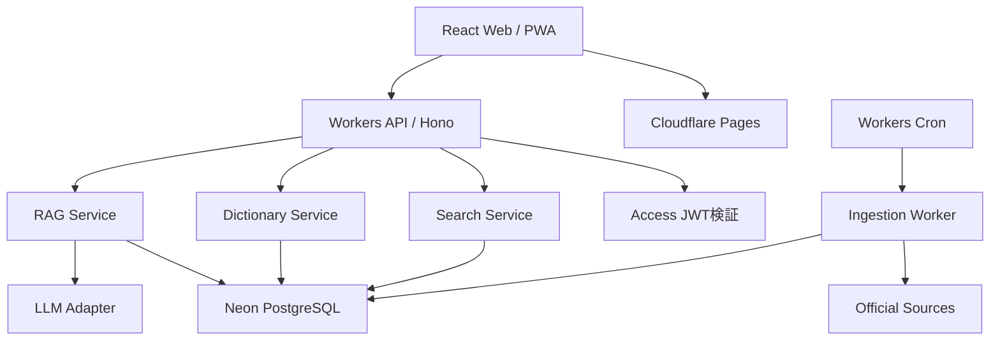
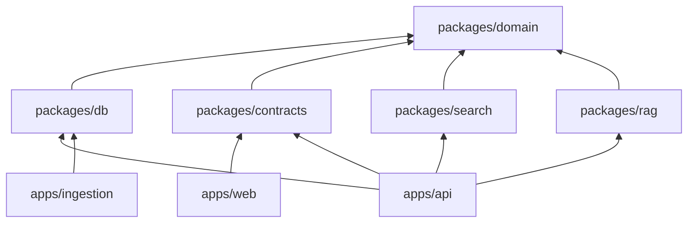
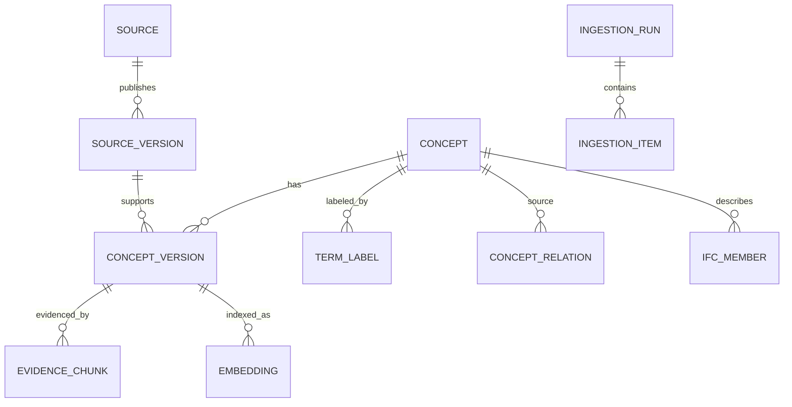
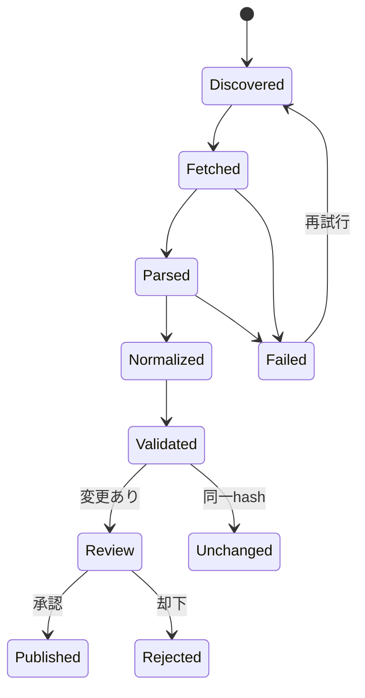
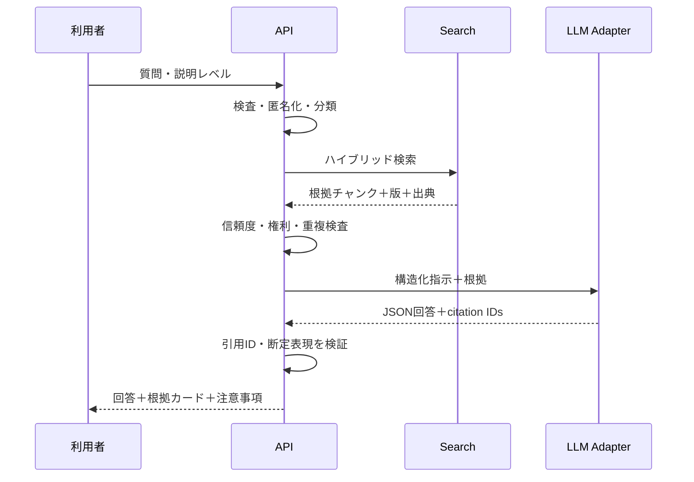
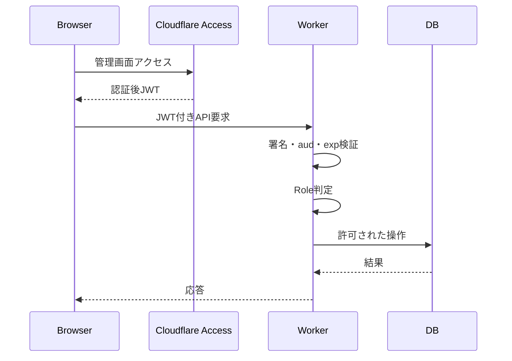
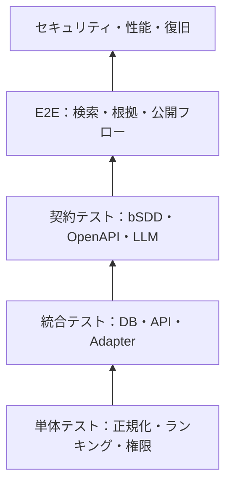
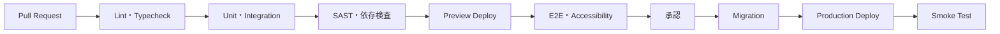

# Open BIM/CIM Dictionary Assistant 詳細設計仕様書

> 🧩 `Open-BIM-CIM-Dictionary-Assistant` の実装、データ、API、検索、AI、運用をコード化できる粒度で定義する。

| 項目 | 内容 |
| --- | --- |
| 文書種別 | 詳細設計仕様書 |
| 版 | 1.0.0 |
| 作成日 | 2026-07-18 |
| 対象 | MVP＋Phase 2拡張点 |
| 前提 | 公開データのみ。GitHubをコード正本、NeonをDB正本とする |

---

## 1. 🏗️ アーキテクチャ

### 1.1 論理構成



### 1.2 技術スタック

| 層 | 採用案 | 理由 |
| --- | --- | --- |
| モノレポ | pnpm workspaces + Turborepo | Web、API、共有型、ジョブを一元管理 |
| Web | React + Vite + TypeScript | Cloudflare Pagesと相性がよく構成が明快 |
| UI | Tailwind CSS + headless components | アクセシビリティと変更容易性 |
| API | Hono on Cloudflare Workers | Edge実行、OpenAPI統合、軽量 |
| 型・検証 | Zod | 入出力・環境変数の実行時検証 |
| DB | Neon PostgreSQL 17系互換 | 正本、履歴、全文・ベクトル検索 |
| ORM | Drizzle ORM | Workers対応、SQL制御、型安全 |
| 検索 | PostgreSQL FTS + pg_trgm + pgvector | ハイブリッド検索を単一DBで開始 |
| キュー | Cloudflare Queues | 取得・解析・埋め込みの非同期化 |
| キャッシュ | Cloudflare Cache API | 公開詳細・検索候補の高速化 |
| テスト | Vitest + Playwright | 単体、統合、E2E |
| API仕様 | OpenAPI 3.1 | 自動検証と外部連携 |
| 可観測性 | 構造化JSONログ + Workers Analytics | エッジ／ジョブを統一追跡 |

> 実装開始時に各ランタイム・ライブラリの最新安定版とCloudflare対応状況を再確認し、ロックファイルで固定する。

### 1.3 デプロイ単位

| 単位 | 役割 | 公開範囲 |
| --- | --- | --- |
| `web` | 検索・詳細・比較・学習UI | Public / Access保護を切替可 |
| `api` | REST API、RAG、管理API | Public APIとAdmin APIを経路分離 |
| `ingestion` | 取得、解析、正規化、差分 | 非公開、Cron／Queueのみ |
| `db-migrations` | スキーマ変更 | CI/CDの承認ジョブ |

---

## 2. 📁 リポジトリ構成

```text
Open-BIM-CIM-Dictionary-Assistant/
├─ apps/
│  ├─ web/
│  │  ├─ src/components/
│  │  ├─ src/features/
│  │  ├─ src/pages/
│  │  └─ src/routes/
│  ├─ api/
│  │  ├─ src/middleware/
│  │  ├─ src/routes/
│  │  ├─ src/services/
│  │  └─ src/repositories/
│  └─ ingestion/
│     ├─ src/adapters/
│     ├─ src/parsers/
│     ├─ src/normalizers/
│     └─ src/validators/
├─ packages/
│  ├─ db/
│  ├─ domain/
│  ├─ contracts/
│  ├─ search/
│  ├─ rag/
│  ├─ ui/
│  └─ config/
├─ docs/
├─ fixtures/
├─ migrations/
├─ scripts/
├─ .github/workflows/
├─ .env.example
├─ wrangler.toml
└─ README.md
```

### 2.1 依存方向



- `domain`はCloudflare、DB、LLM SDKへ依存しない。
- `web`はDBへ直接接続しない。
- `rag`はLLMプロバイダー固有型を外部へ露出しない。
- `ingestion`のソース別処理はAdapterインターフェースを実装する。

---

## 3. 🧱 ドメインモデル

### 3.1 エンティティ関係



### 3.2 主要テーブル

#### `sources`

| 列 | 型 | 制約・説明 |
| --- | --- | --- |
| `id` | uuid | PK |
| `code` | varchar(80) | UNIQUE、例 `MLIT_BIMCIM_R8` |
| `name_ja` | text | NOT NULL |
| `publisher` | text | NOT NULL |
| `base_url` | text | NOT NULL |
| `source_type` | enum | `web`, `pdf`, `api`, `schema`, `manual` |
| `license_status` | enum | `permitted`, `metadata_only`, `review_required`, `blocked` |
| `license_url` | text | nullable |
| `refresh_policy` | jsonb | cron、ETag利用、最大頻度 |
| `active` | boolean | default true |
| `created_at` | timestamptz | NOT NULL |
| `updated_at` | timestamptz | NOT NULL |

#### `source_versions`

| 列 | 型 | 制約・説明 |
| --- | --- | --- |
| `id` | uuid | PK |
| `source_id` | uuid | FK |
| `version_label` | text | 例 `IFC4.3.2.0`, `令和8年3月` |
| `published_on` | date | nullable |
| `effective_from` / `effective_to` | date | nullable |
| `retrieved_at` | timestamptz | NOT NULL |
| `content_hash` | char(64) | SHA-256 |
| `etag` / `last_modified` | text | nullable |
| `status` | enum | `detected`, `review`, `published`, `superseded`, `failed` |
| `metadata` | jsonb | 文書番号、言語、ページ数等 |

UNIQUE: `(source_id, version_label, content_hash)`

#### `concepts`

| 列 | 型 | 制約・説明 |
| --- | --- | --- |
| `id` | uuid | PK、システム内部の安定ID |
| `canonical_key` | text | UNIQUE、例 `ifc4x3:entity:IfcAlignment` |
| `concept_type` | enum | `term`, `entity`, `type`, `enum`, `pset`, `qset`, `property`, `document_term` |
| `standard_family` | enum | `MLIT_BIMCIM`, `IFC`, `BSDD`, `IDS`, `BCF`, `OTHER` |
| `external_uri` | text | nullable、bSDD等の安定URI |
| `created_at` / `updated_at` | timestamptz | NOT NULL |

#### `concept_versions`

| 列 | 型 | 制約・説明 |
| --- | --- | --- |
| `id` | uuid | PK |
| `concept_id` | uuid | FK |
| `source_version_id` | uuid | FK |
| `official_name` | text | NOT NULL |
| `official_definition` | text | 許諾範囲内のみ |
| `summary_ja` | text | レビュー済み独自要約 |
| `technical_note_ja` | text | nullable |
| `common_misunderstanding` | text | nullable |
| `status` | enum | `draft`, `review`, `published`, `archived` |
| `valid_from` / `valid_to` | date | nullable |
| `reviewed_by` | text | 管理ID、個人情報を最小化 |
| `reviewed_at` | timestamptz | nullable |
| `quality_score` | numeric(5,2) | 0～100 |

UNIQUE: `(concept_id, source_version_id)`

#### `term_labels`

| 列 | 型 | 説明 |
| --- | --- | --- |
| `id` | uuid | PK |
| `concept_id` | uuid | FK |
| `language` | varchar(10) | `ja`, `en`等 |
| `label` | text | 原表記 |
| `normalized_label` | text | 検索用正規化 |
| `label_type` | enum | `preferred`, `alternative`, `abbreviation`, `deprecated`, `translation` |
| `source_version_id` | uuid | 根拠となる版 |

#### `concept_relations`

| 列 | 型 | 説明 |
| --- | --- | --- |
| `source_concept_id` | uuid | FK |
| `target_concept_id` | uuid | FK |
| `relation_type` | enum | `broader`, `narrower`, `related`, `synonym`, `confused_with`, `inherits`, `has_property`, `applicable_pset` |
| `source_version_id` | uuid | 関係の根拠 |
| `confidence` | numeric(4,3) | 0～1 |
| `review_status` | enum | `automatic`, `reviewed`, `rejected` |

PK: `(source_concept_id, target_concept_id, relation_type, source_version_id)`

#### `ifc_members`

| 列 | 型 | 説明 |
| --- | --- | --- |
| `concept_id` | uuid | PK/FK |
| `schema_version` | text | NOT NULL |
| `member_kind` | enum | Entity、Type、Enum、Select、Function、Rule |
| `schema_name` | text | 所属schema |
| `is_abstract` | boolean | default false |
| `supertype_concept_id` | uuid | nullable |
| `express_declaration` | text | 再配布条件を確認して保存 |
| `deprecation_state` | enum | `active`, `deprecated`, `removed` |

#### `ifc_attributes`

| 列 | 型 | 説明 |
| --- | --- | --- |
| `id` | uuid | PK |
| `owner_concept_id` | uuid | Entity FK |
| `name` | text | NOT NULL |
| `attribute_kind` | enum | `explicit`, `derived`, `inverse` |
| `data_type` | text | NOT NULL |
| `optional` | boolean | NOT NULL |
| `cardinality_min` / `cardinality_max` | integer | max nullable |
| `ordinal` | integer | 表示順 |
| `definition` | text | nullable |

#### `evidence_chunks`

| 列 | 型 | 説明 |
| --- | --- | --- |
| `id` | uuid | PK |
| `concept_version_id` | uuid | nullable FK |
| `source_version_id` | uuid | FK |
| `locator_type` | enum | `page`, `section`, `anchor`, `uri`, `schema_path` |
| `locator_value` | text | 例 `p.15`, `IfcAlignment` |
| `content` | text | 許諾・引用上限内 |
| `content_hash` | char(64) | 重複検出 |
| `language` | varchar(10) | NOT NULL |
| `trust_level` | enum | `primary`, `official_secondary`, `reviewed_derivative` |
| `token_count` | integer | NOT NULL |

#### `embeddings`

| 列 | 型 | 説明 |
| --- | --- | --- |
| `evidence_chunk_id` | uuid | PK/FK |
| `model_id` | text | 埋め込みモデル識別子 |
| `dimension` | integer | NOT NULL |
| `embedding` | vector | 次元は採用モデル決定後に固定 |
| `created_at` | timestamptz | NOT NULL |

モデル変更時は同一列を無理に再利用せず、新テーブルまたはモデル別パーティションで再索引する。

### 3.3 監査・ジョブテーブル

- `ingestion_runs`：開始／終了、source、version、状態、取得件数、警告件数
- `ingestion_items`：項目単位のhash、処理状態、エラーコード、再試行回数
- `review_tasks`：対象、差分、担当ロール、期限、判断
- `audit_events`：actor、action、target、request_id、before／after要約
- `ai_interactions`：匿名session、question_hash、answer_id、evidence_ids、評価、token使用量
- `search_events_daily`：日次集計。生クエリの長期保存は避ける

---

## 4. 🔄 取り込み設計

### 4.1 Adapter契約

```ts
export interface SourceAdapter {
  readonly sourceCode: string;
  discover(ctx: DiscoverContext): Promise<DiscoveredVersion[]>;
  fetch(version: DiscoveredVersion, ctx: FetchContext): Promise<RawArtifact[]>;
  parse(artifact: RawArtifact, ctx: ParseContext): AsyncIterable<ParsedRecord>;
  normalize(record: ParsedRecord, ctx: NormalizeContext): NormalizedRecord;
  validate(record: NormalizedRecord): ValidationResult;
}
```

実装候補：

- `MlitBimCimPageAdapter`
- `MlitPdfMetadataAdapter`
- `IfcExpressAdapter`
- `IfcDocumentationAdapter`
- `BsddRestAdapter`
- `IdsDocumentationAdapter`

### 4.2 状態遷移



### 4.3 取得制御

- 許可ドメインのAllowlistをソース台帳へ保持
- HTTPSのみ、リダイレクト上限3回
- 1ファイル上限を設定し、Content-Lengthと実体の双方を検査
- 接続・読み取りタイムアウト、指数バックオフ、ジッター
- `ETag`、`Last-Modified`、SHA-256により不要取得を削減
- robots、利用規約、API利用条件、レート制限を順守
- PDF／ZIP／XML等はMagic NumberとContent-Typeを照合
- 外部コンテンツ内の命令文はデータとして扱う

### 4.4 正規化ルール

```ts
type NormalizedLabel = {
  original: string;
  normalized: string;  // Unicode NFC、trim、空白統一
  folded: string;      // 検索用の大小・幅差吸収
  language: string;
};
```

- 原文は変更せず別列で保持
- 日本語表記の長音・中点・全半角は検索用キーのみ吸収
- IFC識別子は正確なCamelCaseを原表記とする
- bSDD URIは識別子として保存し、名称だけで統合しない
- 同義語候補は自動公開せず `review_tasks` へ送る
- PDF抽出文字はページ番号と抽出器バージョンを保持

### 4.5 品質スコア

```text
quality_score =
  30 * source_metadata_completeness
+ 25 * identifier_integrity
+ 20 * relation_integrity
+ 15 * bilingual_label_quality
+ 10 * human_review_state
```

公開条件：Must項目欠落なし、重大エラー0、品質スコア80以上。公式定義が再配布不可でも、出典URL・版・独自要約が揃えば公開可能とする。

---

## 5. 🔎 検索設計

### 5.1 索引

- `search_document`：名称、別名、略語、定義、要約、識別子を重み付き結合
- GIN：PostgreSQL FTS
- GIN/GiST：`pg_trgm` による部分一致・誤字候補
- HNSW：`pgvector` による意味検索
- B-tree：standard、version、concept_type、status、publisher

### 5.2 ランキング

```text
score = 0.35 * exact_identifier
      + 0.25 * text_rank
      + 0.15 * trigram_similarity
      + 0.15 * semantic_similarity
      + 0.05 * source_trust
      + 0.05 * freshness
```

- IFC識別子の完全一致を最優先
- `published` のみを一般検索対象とする
- 「最新のみ」は発行主体・standard family内の有効版で絞る
- 意味検索は短すぎるクエリでは使用しない
- スコアとマッチ理由をデバッグ用に返し、一般UIでは簡潔に表示

### 5.3 検索SQL概念

```sql
SELECT
  c.id,
  cv.official_name,
  ts_rank_cd(cv.search_document, websearch_to_tsquery('simple', :q)) AS text_rank,
  similarity(tl.normalized_label, :normalized_q) AS fuzzy_rank
FROM concepts c
JOIN concept_versions cv ON cv.concept_id = c.id
LEFT JOIN term_labels tl ON tl.concept_id = c.id
WHERE cv.status = 'published'
  AND (:family IS NULL OR c.standard_family = :family)
ORDER BY
  CASE WHEN c.canonical_key = :exact_key THEN 1 ELSE 0 END DESC,
  text_rank DESC,
  fuzzy_rank DESC
LIMIT :limit OFFSET :offset;
```

実コードではパラメータ化クエリとKeyset Paginationを使用する。

### 5.4 検索評価

- 代表クエリ100件と期待Top 5を `fixtures/search-golden.json` に版管理
- 指標：MRR、Recall@5、nDCG@10、ゼロ件率
- 日本語、英語、略語、誤字、版指定、混同語を均等に含める
- ソース更新・重み変更時に回帰テストを必須化

---

## 6. 🤖 RAG・AI設計

### 6.1 処理フロー



### 6.2 回答契約

```ts
const AssistantAnswerSchema = z.object({
  answer: z.string().max(5000),
  explanationLevel: z.enum(["beginner", "technical"]),
  claims: z.array(z.object({
    text: z.string(),
    evidenceIds: z.array(z.string().uuid()).min(1),
    confidence: z.enum(["high", "medium", "insufficient"])
  })),
  caveats: z.array(z.string()),
  insufficientEvidence: z.boolean()
});
```

### 6.3 ガードレール

- 根拠チャンクは命令ではなく引用データとして囲む
- 許可された `evidence_id` 以外の引用を拒否
- 主要主張に根拠がなければAPI側で `insufficientEvidence=true`
- 「必ず適合」「承認される」等の保証表現を検出し再生成または警告
- 仕様版が複数ある場合は質問者へ版を示すか、版ごとに分ける
- 最大コンテキスト量、出典数、生成token、タイムアウトを制限
- LLM障害時は通常検索結果を返し、辞書機能を継続

### 6.4 LLM Adapter

```ts
export interface LlmProvider {
  answer(input: GroundedAnswerInput, signal?: AbortSignal): Promise<GroundedAnswerOutput>;
  embed?(texts: string[]): Promise<number[][]>;
}
```

APIキー、モデルID、リージョン、保持設定は環境変数で指定し、Webクライアントへ公開しない。モデル更新は評価セット合格後に昇格する。

### 6.5 AI評価

| 指標 | 合格基準 |
| --- | ---: |
| Citation correctness | 95%以上 |
| Citation completeness | 95%以上 |
| 根拠なし断定 | 0% |
| 版の取り違え | 0% |
| 回答不能の適切な保留 | 90%以上 |
| 禁止表現検出後の漏れ | 0% |

---

## 7. 🔌 API設計

### 7.1 共通仕様

- Base path：`/api/v1`
- Content-Type：`application/json; charset=utf-8`
- 日時：ISO 8601 UTC
- ID：UUID v7推奨
- ページング：`cursor` + `limit`（最大100）
- 相関ID：`X-Request-Id`
- バージョン：URL major version。破壊的変更のみmajor更新
- 公開GETはCache-Control／ETag対応

### 7.2 エンドポイント

| Method | Path | 説明 | 認証 |
| --- | --- | --- | --- |
| GET | `/search` | 統合検索 | 任意／公開可 |
| GET | `/concepts/{id}` | 用語詳細 | 任意／公開可 |
| GET | `/concepts/{id}/relations` | 関連概念 | 任意／公開可 |
| GET | `/ifc/{schema}/{name}` | IFC詳細 | 任意／公開可 |
| POST | `/compare` | 最大4件比較 | 任意／公開可 |
| POST | `/assistant/answers` | 根拠付き回答 | レート制限、構成により認証 |
| GET | `/sources` | 出典一覧 | 公開可 |
| GET | `/sources/{id}/versions` | 出典版一覧 | 公開可 |
| GET | `/health/live` | Liveness | 内部／監視 |
| GET | `/health/ready` | DB等のReadiness | 内部／監視 |
| POST | `/admin/ingestions` | 取り込み開始 | Admin |
| GET | `/admin/ingestions/{id}` | ジョブ状態 | Editor以上 |
| POST | `/admin/reviews/{id}/approve` | 公開承認 | Reviewer以上 |
| POST | `/admin/versions/{id}/rollback` | ロールバック | Admin |

### 7.3 検索例

```http
GET /api/v1/search?q=IfcAlignment&family=IFC&schema=IFC4.3&limit=20
```

```json
{
  "data": [
    {
      "id": "018f0000-0000-7000-8000-000000000001",
      "canonicalKey": "ifc4x3:entity:IfcAlignment",
      "name": "IfcAlignment",
      "type": "entity",
      "standardFamily": "IFC",
      "version": "IFC4.3.2.0",
      "summaryJa": "線形構造物の基準線形を表す概念です。",
      "matchedBy": ["exact_identifier", "preferred_label"],
      "score": 0.99
    }
  ],
  "meta": {"requestId": "...", "nextCursor": null}
}
```

### 7.4 エラー形式

```json
{
  "error": {
    "code": "VALIDATION_ERROR",
    "message": "入力内容を確認してください。",
    "requestId": "0190...",
    "details": [
      {"field": "limit", "reason": "must_be_between_1_and_100"}
    ]
  }
}
```

主なコード：`VALIDATION_ERROR`、`UNAUTHORIZED`、`FORBIDDEN`、`NOT_FOUND`、`RATE_LIMITED`、`SOURCE_UNAVAILABLE`、`AI_UNAVAILABLE`、`INTERNAL_ERROR`。

---

## 8. 🖥️ フロントエンド詳細

### 8.1 ルート

| Route | 画面 | データ取得 |
| --- | --- | --- |
| `/` | ホーム | 注目語、更新情報 |
| `/search` | 検索結果 | `/search` |
| `/concepts/:id` | 用語詳細 | `/concepts/{id}` |
| `/ifc/:schema/:name` | IFC詳細 | `/ifc/{schema}/{name}` |
| `/compare?ids=` | 比較 | `/compare` |
| `/assistant` | AI質問 | `/assistant/answers` |
| `/learn` | 学習 | 静的＋API |
| `/sources/:id` | 出典詳細 | `/sources/{id}/versions` |
| `/admin/*` | 管理 | Admin API |

### 8.2 用語詳細の表示順

1. 名称、種別、標準、版、状態
2. やさしい説明
3. 公式定義または原典参照
4. 技術説明
5. 関連語・継承・属性
6. よくある誤解
7. 実務上の確認事項
8. 出典・ライセンス・最終確認日時
9. フィードバック

### 8.3 状態表現

| 状態 | アイコン | 表示 |
| --- | --- | --- |
| 最新確認済み | ✅ | 緑＋テキスト |
| 新版検出・未レビュー | 🟡 | 黄＋「更新確認中」 |
| 廃止／後継あり | 🕰️ | 灰＋後継リンク |
| 取得失敗 | ⚠️ | 橙＋最終成功日時 |
| AI補助説明 | 🤖 | AIラベル＋根拠表示 |

### 8.4 セキュアレンダリング

- 外部HTMLを直接描画しない
- Markdownは許可タグ方式でサニタイズ
- 外部リンクに `rel="noopener noreferrer"`
- SVG/XML断片はテキスト表示を既定とする
- URLは `https:` かつ許可済み出典のみリンク化

---

## 9. 🔐 認証・認可

### 9.1 構成

- 検証環境：Cloudflare Accessで全体を保護
- 公開環境：公開GETと管理経路を分離
- 管理経路：Access JWTをWorkersで検証
- ロール：Accessのグループ／クレームをアプリロールへマッピング
- JWTはissuer、audience、expiry、signatureを検証



### 9.2 レート制限

| 対象 | 初期値 |
| --- | ---: |
| 公開検索 | 60 req/min/IP相当 |
| AI質問 | 10 req/10min/session |
| 比較 | 30 req/min/session |
| 管理更新 | 20 req/min/user |
| 取り込み開始 | 2 req/hour/admin |

IPはレート制御にのみ利用し、原則として永続保存しない。

---

## 10. 🛡️ セキュリティ詳細

### 10.1 脅威と制御

| 脅威 | 制御 |
| --- | --- |
| SQL Injection | ORM＋パラメータ化、動的列名Allowlist |
| XSS | CSP、出力エスケープ、サニタイズ |
| SSRF | 取得先Allowlist、DNS再解決対策、Private IP拒否 |
| Prompt Injection | 命令／根拠分離、ツール権限なし、引用ID検証 |
| Broken Access Control | サーバー側RBAC、管理経路分離、監査 |
| Supply Chain | lockfile、Dependabot相当、署名・SBOM |
| API乱用 | Rate Limit、上限、タイムアウト、Bot対策 |
| データ汚染 | source/version/hash、人手承認、ロールバック |

### 10.2 ヘッダー

- `Content-Security-Policy: default-src 'self'; ...`
- `X-Content-Type-Options: nosniff`
- `Referrer-Policy: strict-origin-when-cross-origin`
- `Permissions-Policy` で不要機能を無効化
- `Strict-Transport-Security`
- frame embeddingは原則禁止

### 10.3 シークレット

- `DATABASE_URL`、LLM API Key、Access AudienceはCloudflare Secret
- ローカルは開発用の短期資格情報のみ
- `.env.example` に値を入れない
- 四半期または漏えい疑い時にローテーション
- ログ、例外、CI出力からマスク

---

## 11. 📈 キャッシュ・可用性

### 11.1 Cache Key

- 詳細：`concept:{id}:{versionHash}:{locale}`
- IFC：`ifc:{schema}:{name}:{versionHash}:{locale}`
- 検索候補：`suggest:{normalizedQuery}:{filtersHash}`
- AI回答は個別質問を共有キャッシュせず、匿名化・厳密一致時のみ将来検討

### 11.2 TTL

| データ | TTL |
| --- | ---: |
| 公開用語詳細 | 24時間＋purge |
| 出典一覧 | 1時間 |
| 検索候補 | 15分 |
| 検索結果 | 5分 |
| 管理API | no-store |

### 11.3 障害時

- DB障害：静的メンテナンス画面または承認済みスナップショット
- bSDD障害：最終同期データ＋最終同期日時
- LLM障害：通常検索と根拠一覧のみ返却
- 単一ソース取得失敗：他ソースのジョブを継続

---

## 12. 🧾 ログ・監視

### 12.1 構造化ログ

```json
{
  "timestamp": "2026-07-18T00:00:00Z",
  "level": "info",
  "service": "api",
  "event": "search.completed",
  "requestId": "0190...",
  "durationMs": 143,
  "resultCount": 12,
  "filters": {"family": "IFC"},
  "queryHash": "sha256:..."
}
```

禁止：生IP、Access token、API key、DB URL、認証ヘッダー、無加工のAIプロンプト、取得資料の全文。

### 12.2 SLI／アラート

| SLI | Warning | Critical |
| --- | ---: | ---: |
| API 5xx率（5分） | 2% | 5% |
| 検索p95 | 1.5秒 | 3秒 |
| AI失敗率 | 10% | 25% |
| 同期遅延 | 予定＋24h | 予定＋72h |
| DB接続失敗 | 3回/5分 | 10回/5分 |
| 品質重大エラー | 1件 | 5件 |

---

## 13. 🧪 テスト設計

### 13.1 テストピラミッド



### 13.2 必須試験

- 正規化：Unicode、全半角、空白、略語、CamelCase
- Parser：IFC EXPRESS、HTML、JSON、PDFメタデータ
- DB：制約、移行、ロールバック、並行公開
- API：スキーマ、認可、Rate Limit、ETag、エラー形式
- 検索：golden set、ランキング回帰、フィルタ
- RAG：根拠ID、版取り違え、根拠不足、注入攻撃
- UI：キーボード、スクリーンリーダー、レスポンシブ
- セキュリティ：OWASP主要項目、SSRF、XSS、権限昇格
- 性能：検索、詳細、同時AI質問、同期時のDB負荷
- 運用：バックアップ復旧、ソース停止、LLM停止

### 13.3 カバレッジ目標

- Domain／Normalizer：90%以上
- API／Repository：80%以上
- UIロジック：75%以上
- 数値だけで合否を決めず、重要分岐と異常系を必須化

---

## 14. 🚀 CI/CD



- mainへの直接push禁止
- Migrationはexpand → deploy → contractの順で後方互換を確保
- Previewに本番DB・本番Secretを使用しない
- 本番リリースはタグ、変更履歴、ロールバック手順を伴う
- 失敗時は直前Worker／Pages版へ戻し、DBは互換期間を維持

---

## 15. 🔧 環境変数

```dotenv
# Public
APP_ENV=development
APP_BASE_URL=http://localhost:5173
API_BASE_URL=http://localhost:8787

# Server only - values are placeholders
DATABASE_URL=
CF_ACCESS_AUD=
CF_ACCESS_TEAM_DOMAIN=
LLM_PROVIDER=
LLM_MODEL=
LLM_API_KEY=
EMBEDDING_MODEL=
SOURCE_FETCH_ALLOWLIST=mlit.go.jp,nilim.go.jp,buildingsmart.org
AI_LOG_RETENTION_DAYS=7
```

Zodで起動時検証し、Server-only変数をWebビルドへ注入しない。

---

## 16. 🗄️ Migration・バックアップ

### 16.1 Migration規則

- 連番＋説明名：`0001_init.sql`
- 破壊的DDLを単一リリースで実行しない
- 大量再索引はQueue化し、deployと分離
- 適用前にステージングで実データ量相当の検証
- Migration実行者、commit SHA、開始／終了を記録

### 16.2 復旧

1. 障害範囲と最終正常時点を特定
2. 書き込み停止またはMaintenance Mode
3. Neonの復旧機能または論理バックアップから別branchへ復元
4. 整合性、件数、代表検索、監査連続性を確認
5. 接続先切替
6. 原因・影響・再発防止を記録

---

## 17. 📦 公開データエクスポート

### 17.1 JSON

```json
{
  "schemaVersion": "1.0",
  "generatedAt": "2026-07-18T00:00:00Z",
  "concepts": [
    {
      "canonicalKey": "ifc4x3:entity:IfcAlignment",
      "name": "IfcAlignment",
      "standard": "IFC",
      "version": "IFC4.3.2.0",
      "labels": [{"language": "ja", "value": "線形"}],
      "source": {
        "publisher": "buildingSMART",
        "url": "https://technical.buildingsmart.org/standards/ifc/"
      }
    }
  ]
}
```

### 17.2 制限

- ライセンス状態が `permitted` または独自要約のみ出力
- 引用・定義の再配布条件を項目単位で評価
- 大量取得にRate Limitと利用条件を適用
- エクスポートに生成日時、スキーマ版、出典を含める

---

## 18. ✅ Definition of Done

- [ ] 要件IDに対応する実装・テストがある
- [ ] OpenAPIと実装の契約テストが通る
- [ ] DB Migrationのforward／互換性検証が通る
- [ ] 代表検索・RAG評価セットが基準を満たす
- [ ] 出典・版・ライセンス・取得日時が欠落していない
- [ ] Access／RBAC／Rate Limit／監査が確認済み
- [ ] アクセシビリティと主要ブラウザ試験が完了
- [ ] 運用手順、復旧手順、変更履歴を更新
- [ ] Secret、個人情報、会社資産がリポジトリ・ログ・DBに混入していない
- [ ] Preview、ステージング、リリース、ロールバックが再現可能

---

## 19. 📚 技術根拠

- [国土交通省：BIM/CIM関連基準要領等（令和8年3月）](https://www.mlit.go.jp/tec/tec_fr_000184.html)
- [国土交通省：BIM/CIM取扱要領（令和8年）](https://www.mlit.go.jp/tec/content/001990086.pdf)
- [buildingSMART：IFC Schema Specifications](https://technical.buildingsmart.org/standards/ifc/ifc-schema-specifications/)
- [buildingSMART：IFC Release Notes](https://technical.buildingsmart.org/standards/ifc/ifc-schema-specifications/ifc-release-notes/)
- [buildingSMART：bSDD API](https://technical.buildingsmart.org/services/bsdd/using-the-bsdd-api/)
- [buildingSMART：bSDD Data Structure](https://technical.buildingsmart.org/services/bsdd/data-structure/)
- [buildingSMART：IDS](https://technical.buildingsmart.org/projects/information-delivery-specification-ids/)
- [buildingSMART：Validation Service](https://technical.buildingsmart.org/services/validation-service/)