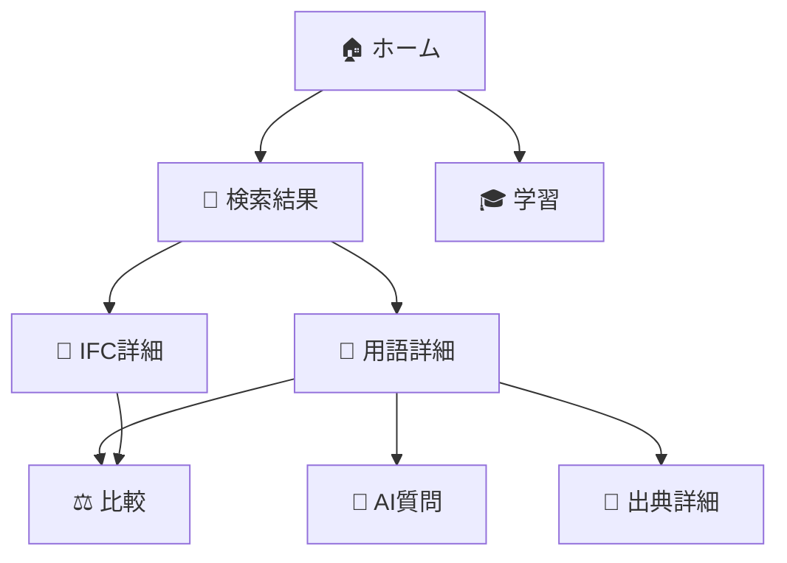
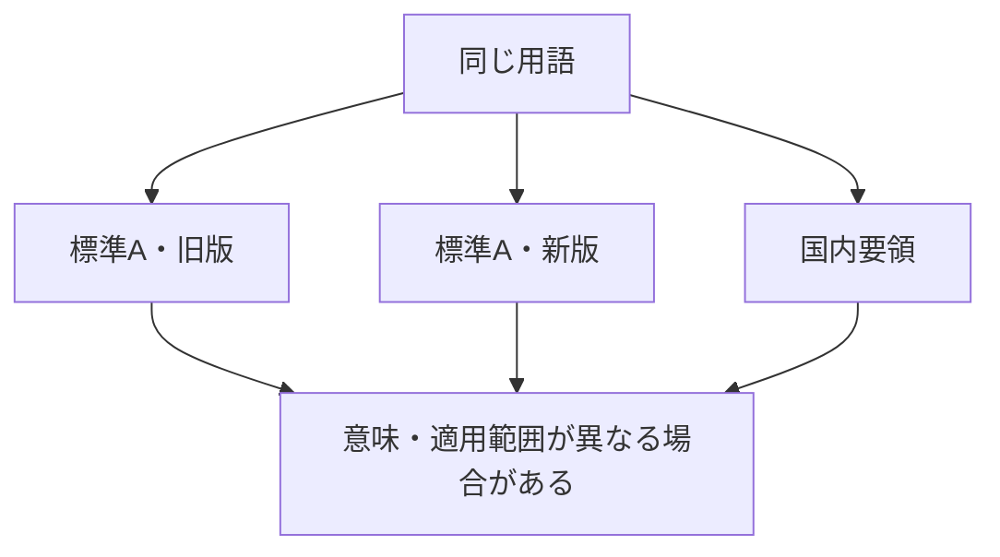
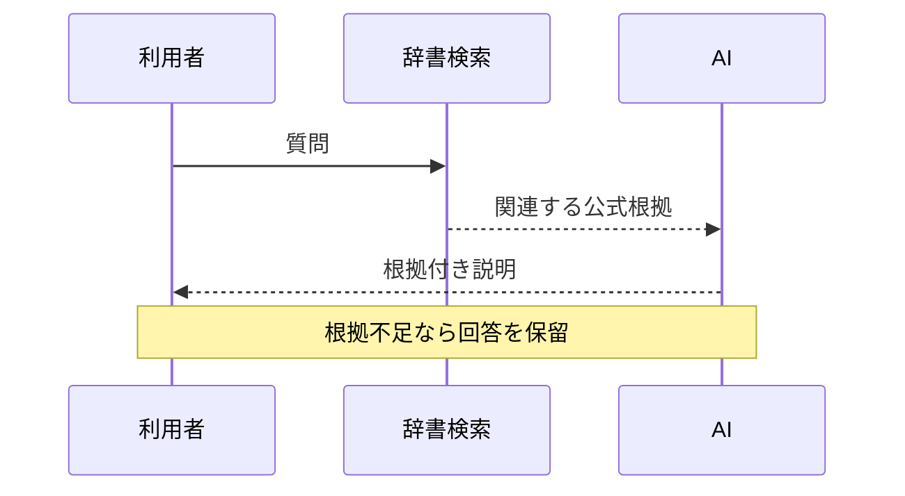
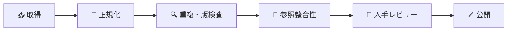
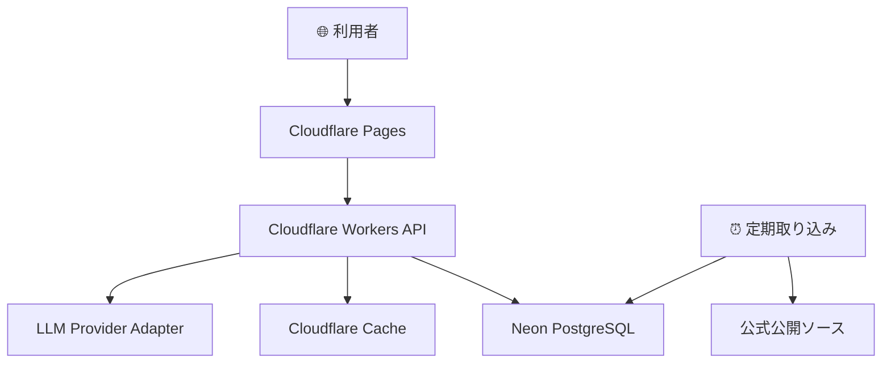
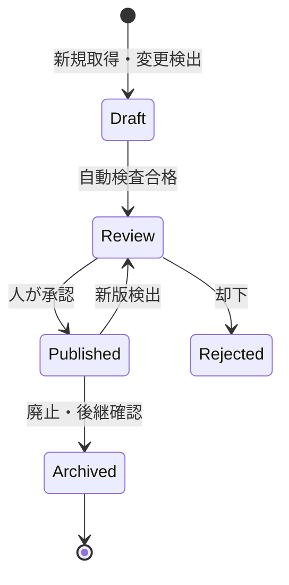
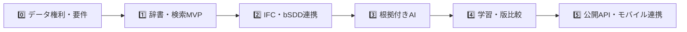

# 🧭 Open BIM/CIM Dictionary Assistant

> **BIM/CIM、IFC、属性情報、公開仕様を「探せる・分かる・根拠へ戻れる」辞書型Webアシスタント**

[](#-開発ステータス)
[](#-データ方針)
[](#-収録対象)
[](#-ライセンス)

## 🌟 これは何ですか？

`Open-BIM-CIM-Dictionary-Assistant` は、BIM/CIM・openBIM・IFC・属性情報に関する公開仕様を横断検索し、初心者向け説明、技術定義、関連用語、版、出典をまとめて確認できるWebシステムです。

たとえば「IfcAlignmentとは？」「属性とプロパティは同じ？」「この説明はIFCのどの版？」といった疑問に、原典リンク付きで答えます。


## 🎯 目指すこと

- 🔎 複数の公開仕様書を横断して検索できる
- 🧑‍🎓 若手・非専門者にも理解しやすく説明する
- 🧩 IFCエンティティ、属性、Pset、Qtoの関係を見える化する
- 📌 説明の根拠、版、発行主体、取得日時を明示する
- 🤖 AIの推測を抑え、根拠不足なら「分からない」と示す
- 🌐 会社資産や社内情報を使わず、公開情報だけで価値を提供する

## 👥 こんな方に向いています

| 利用者 | できること |
| --- | --- |
| 🧑‍🎓 若手技術者 | 略語や基本概念をやさしい説明で学ぶ |
| 👷 現場管理者 | 属性情報やBIM/CIM運用用語を確認する |
| 🏗️ 設計・BIM/CIM担当 | IFCクラス、Pset、版、関連概念を調べる |
| 🔬 研究者 | 国内外の公開標準を横断調査する |
| 💻 IT・DX担当 | 辞書データ、更新、品質、APIを管理する |
| 🧑‍💼 経営・管理層 | 教育・標準化の狙いと利用状況を把握する |

## 🖥️ 主な機能

| 機能 | 説明 |
| --- | --- |
| 🔎 統合検索 | 日本語、英語、略語、別名、IFC識別子から検索 |
| 🎚️ 絞り込み | 標準、版、発行主体、カテゴリ、分野で絞り込み |
| 📘 用語詳細 | やさしい説明、公式定義、技術説明、注意点を表示 |
| 🧩 IFC詳細 | 継承、属性、列挙値、Pset、Qtoを表示 |
| ⚖️ 比較 | 最大4つの用語・版を比較 |
| 🤖 AI質問 | 検索した根拠だけを使って回答 |
| 🎓 学習 | 用語カード、関連語、確認問題 |
| 🔗 出典管理 | 原典URL、版、発行日、取得日時、ライセンスを表示 |
| 🛠️ 管理 | 取り込み差分、品質警告、レビュー、公開、ロールバック |

## 🧭 画面の流れ



## ✨ 表示イメージ

```text
IfcAlignment                                      IFC 4.3.2.0
────────────────────────────────────────────────────────────
やさしい説明
  道路・鉄道などの線形構造物で、基準となる線形を表す概念です。

分類
  Entity / Infrastructure / Alignment

関連
  上位概念、水平線形、縦断線形、カント、関連Property Set

出典
  buildingSMART IFC Schema Specifications
  版：IFC 4.3.2.0  最終確認：YYYY-MM-DD
```

実際の画面では、色だけに頼らない状態ラベル、キーボード操作、原典リンク、関係図のテキスト代替を備えます。

## 🗂️ 収録対象

### MVP

- 国土交通省・国総研のBIM/CIM公開基準・要領
- buildingSMART IFC 4.3
- IFC Entity、Type、Enum、Select、Attribute
- Property Set（Pset）とQuantity Set（Qto）
- buildingSMART Data Dictionary（bSDD）の公開Dictionary、Class、Property
- openBIM、IDS、BCF、MVD、IDMの基本用語

### 将来拡張

- IFC4とIFC4.3等の版差分
- IDS要件の検索・解説
- BCF・MVD・IDMの詳細
- オフライン学習用PWA
- iPhone／iPad向け「Civil Knowledge Pocket」連携
- 他の公開土木DXシステム向け共通知識API

## 🔍 なぜ「版」と「出典」が重要？



本システムは、用語名だけで情報を統合しません。発行主体、標準、版、安定URI、出典を照合し、意味が異なる項目は別の知識として保持します。

## 🤖 AI回答の考え方

AIは「先生役」ではなく、公式資料へ案内するナビゲーターです。



### AIが行うこと

- 質問を検索語へ変換する
- 複数の根拠を分かりやすく整理する
- 初心者向け／技術者向けに説明レベルを調整する
- 回答ごとに出典を示す

### AIが行わないこと

- 仕様適合、契約、設計、積算、施工可否を保証する
- 根拠がない内容を補って断定する
- 版が異なる定義を混ぜて一つの定義にする
- 社内・案件・個人情報を学習用データとして収集する

## 🧹 データ品質



- 原表記と検索用正規化表記を分けて保持
- Unicode、全角／半角、空白、ハイフン等の表記揺れを吸収
- 版の異なる定義を上書きしない
- AI翻訳・AI要約を公式定義と明確に区別
- 出典、版、ライセンス、取得日時が欠ける項目は公開しない
- 公式ソース更新時は差分を人が確認してから公開

## 🏗️ システム構成



| 基盤 | 役割 |
| --- | --- |
| Claude Code on Linux | 開発作業台 |
| GitHub | ソースコード、設計書、READMEの正本 |
| Cloudflare Pages / Workers / Access | Web、API、検証入口、実行基盤 |
| Neon PostgreSQL | 辞書、版、出典、検索索引の正本 |

Linuxローカル、SQLite、Docker Volumeを本番データの正本にしません。

## 📁 想定リポジトリ構成

```text
Open-BIM-CIM-Dictionary-Assistant/
├─ apps/
│  ├─ web/                 # 検索・学習UI
│  ├─ api/                 # REST API・AI回答
│  └─ ingestion/           # 公式データ取り込み
├─ packages/
│  ├─ db/                  # DBスキーマ・Query
│  ├─ domain/              # 用語・版・出典のルール
│  ├─ contracts/           # API型・OpenAPI
│  ├─ search/              # 全文・曖昧・意味検索
│  ├─ rag/                 # 根拠付き回答
│  └─ ui/                  # 共通UI
├─ docs/                   # 設計・運用文書
├─ migrations/             # DB Migration
├─ fixtures/               # 公開サンプル・評価データ
└─ .github/workflows/      # CI/CD
```

## 🚀 セットアップ（実装開始後）

### 必要なもの

- Node.js：リポジトリで固定するLTS版
- pnpm：`packageManager`で固定する版
- CloudflareアカウントとWrangler
- Neon PostgreSQLプロジェクト
- GitHubリポジトリ
- 任意の対応LLM API（AI機能を利用する場合）

### 1. Clone

```bash
git clone https://github.com/Kensan196948G/Open-BIM-CIM-Dictionary-Assistant.git
cd Open-BIM-CIM-Dictionary-Assistant
```

### 2. 依存関係

```bash
corepack enable
pnpm install --frozen-lockfile
```

### 3. 環境変数

```bash
cp .env.example .env.local
```

`.env.local` に開発用の値を設定します。APIキーやDB接続情報をGitへ登録しないでください。

```dotenv
APP_ENV=development
APP_BASE_URL=http://localhost:5173
API_BASE_URL=http://localhost:8787
DATABASE_URL=
LLM_PROVIDER=
LLM_MODEL=
LLM_API_KEY=
```

### 4. DB

```bash
pnpm db:migrate
pnpm db:seed
```

Seedには公開サンプルとテスト専用データだけを使用します。

### 5. 起動

```bash
pnpm dev
```

### 6. 品質確認

```bash
pnpm lint
pnpm typecheck
pnpm test
pnpm test:e2e
pnpm build
```

> コマンドは実装時の最終構成に合わせて更新します。現時点では設計上の予定です。

## 🌍 環境

| 環境 | 用途 | データ |
| --- | --- | --- |
| Local | 開発・単体確認 | 公開fixture・一時データ |
| Preview | Pull Request確認 | 専用DB branch・サンプル |
| Staging | 結合・UAT | 公開データの検証コピー |
| Production | 公開運用 | 承認済み公開辞書 |

環境ごとにCloudflare／Neonの接続先とSecretを分離します。

## 🔐 セキュリティ

- 🔒 管理画面はCloudflare Accessで保護
- 🪪 WorkersでJWTとロールを検証
- 🚫 APIキー、DB接続情報をブラウザへ配布しない
- 🧱 SQL Injection、XSS、CSRF、SSRFを防止
- 🧼 HTML／Markdownを安全化して表示
- 🛑 外部取得先を公式Allowlistに限定
- ⏱️ 検索・AI・管理APIへRate Limitを設定
- 🧾 編集、承認、公開、ロールバックを監査記録
- 📦 依存関係検査、SBOM、Secret ScanをCIで実施

## 🗃️ データ方針

### 利用するもの

- ✅ 国・公的機関の公開資料
- ✅ buildingSMART等の公式公開標準・API
- ✅ 再配布条件を確認した公開用語集
- ✅ 独自に作成しレビューした説明
- ✅ 公開サンプル・ローカル検証データ

### 利用しないもの

- ❌ AD／Entra IDの実データ
- ❌ HENNGE ONE、SharePoint、DirectCloudの社内情報
- ❌ DeskNet's NEO、ファイルサーバ、案件情報
- ❌ 個人情報、発注者限定情報、契約上非公開の資料
- ❌ 再配布権のない規格本文の無断保存・転載

## 🔄 更新・公開フロー



外部サイトが変わっても、自動で即時公開はしません。差分と権利条件を確認し、承認済み版を公開します。

## 🧪 テスト方針

| テスト | 主な確認 |
| --- | --- |
| Unit | 正規化、版判定、関係、ランキング、権限 |
| Integration | DB、API、取り込みAdapter |
| Contract | bSDD、OpenAPI、LLM出力 |
| E2E | 検索→詳細→出典、質問→根拠、公開フロー |
| Accessibility | キーボード、ラベル、コントラスト、読み上げ |
| Security | XSS、SSRF、権限、Rate Limit、Prompt Injection |
| Performance | 検索p95、同時利用、同期中の負荷 |
| Recovery | バックアップ復旧、外部API／AI停止 |

## 📊 目標品質

- 検索API：p95 1.5秒以内
- 用語詳細API：p95 800ms以内
- AI回答：根拠表示率100%
- 必須メタデータ欠落率0%
- 代表検索Top 5再現率90%以上
- AI回答の根拠なし断定0件
- WCAG 2.2 AA相当
- MVP可用性99.5%以上

## 📖 ドキュメント

| 文書 | 内容 |
| --- | --- |
| `Open-BIM-CIM-Dictionary-Assistant_要件定義書_20260718.md` | 何を、なぜ、どこまで実現するか |
| `Open-BIM-CIM-Dictionary-Assistant_詳細設計仕様書_20260718.md` | どの構造・処理・API・DBで実装するか |
| `README.md` | 利用者・開発者向けの入口 |

## 🗺️ 開発ロードマップ



## 🚦 開発ステータス

| 項目 | 状態 |
| --- | --- |
| 構想 | ✅ |
| 要件定義 | ✅ 初版 |
| 詳細設計 | ✅ 初版 |
| 実装 | ⏳ 未着手 |
| 検証 | ⏳ 未着手 |
| 公開 | ⏳ 未着手 |

## ⚠️ 免責

本システムは、公開情報の検索・理解・教育を支援するものです。設計、積算、施工、成果品、契約、法令・基準適合性を保証するものではありません。実務上の判断では、対象案件に適用される最新版の契約図書、基準、要領、発注者指示、原典を必ず確認してください。

## 📚 公式参照先

- [国土交通省：BIM/CIM関連基準要領等（令和8年3月）](https://www.mlit.go.jp/tec/tec_fr_000184.html)
- [国土交通省：BIM/CIM取扱要領（令和8年）](https://www.mlit.go.jp/tec/content/001990086.pdf)
- [buildingSMART：IFC Schema Specifications](https://technical.buildingsmart.org/standards/ifc/ifc-schema-specifications/)
- [buildingSMART：Industry Foundation Classes](https://www.buildingsmart.org/standards/bsi-standards/industry-foundation-classes/)
- [buildingSMART：Using the bSDD API](https://technical.buildingsmart.org/services/bsdd/using-the-bsdd-api/)
- [buildingSMART：bSDD Data Structure](https://technical.buildingsmart.org/services/bsdd/data-structure/)
- [buildingSMART：Information Delivery Specification](https://technical.buildingsmart.org/projects/information-delivery-specification-ids/)
- [buildingSMART：BIM Collaboration Format](https://technical.buildingsmart.org/standards/bcf/)
- [buildingSMART：IFC Validation Service](https://technical.buildingsmart.org/services/validation-service/)

## 📜 ライセンス

プロジェクト本体のライセンスは、実装開始前に決定します。候補はApache-2.0またはMITです。

取り込む各公開データ・仕様・文書には、それぞれの発行主体の著作権・利用条件が適用されます。プロジェクト本体のライセンスが、収録データへ自動的に適用されるわけではありません。

---

<div align="center">

**🏗️ openBIM/CIMを、調べやすく。教えやすく。根拠へ戻りやすく。**

</div>