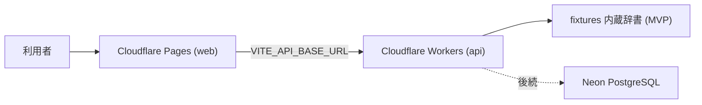

# 🚀 デプロイ・運用手順書（Deployment & Operations Runbook）

> 対象: Open BIM/CIM Dictionary Assistant MVP（fixtures ベース検索辞書）
> スタック: Cloudflare Workers (API) + Cloudflare Pages (Web) + Neon PostgreSQL（後続接続）
> ⚠️ **本番デプロイ・公開は人間（管理者）が手動で実行する。** CTO/AI は準備までを行い、実行しない。

---

## 📌 1. 構成サマリー

| 単位 | 実体 | デプロイ先 | 設定ファイル |
| --- | --- | --- | --- |
| API | `apps/api`（Hono / fixtures リポジトリ内蔵） | Cloudflare Workers | `apps/api/wrangler.toml` |
| Web | `apps/web`（React SPA） | Cloudflare Pages | ビルド出力 `apps/web/dist` + `_redirects` |
| DB | `migrations/0001_init.sql` | Neon PostgreSQL | 後続 Issue #12（プロジェクト作成は人間決裁） |



---

## ✅ 2. リリース前チェックリスト

デプロイ実行前に、すべて ✅ であることを確認する。

- [ ] main の CI（lint / typecheck / test / build / e2e / audit）が success
- [ ] `pnpm audit --audit-level high` が 0 件
- [ ] CodeRabbit レビューの Critical / High 指摘が 0 件
- [ ] README・本手順書が実装と一致
- [ ] `.env` / シークレットがリポジトリ・ログに含まれない（`git grep` 確認済み）
- [ ] migration up/down の round-trip 検証済み（§6 参照）
- [ ] ロールバック手順（§5）を読了・準備済み
- [ ] Cloudflare アカウントの権限・Wrangler ログイン確認（人間）

---

## 🔨 3. 初回デプロイ手順（人間が実行）

### 3.1 API — Cloudflare Workers

```bash
# 1) Cloudflare 認証（ブラウザが開く）
pnpm dlx wrangler@latest login

# 2) デプロイ（apps/api/wrangler.toml を使用）
cd apps/api
pnpm dlx wrangler@latest deploy

# 3) 動作確認
curl https://obcda-api.<ACCOUNT_SUBDOMAIN>.workers.dev/api/v1/health/live
curl "https://obcda-api.<ACCOUNT_SUBDOMAIN>.workers.dev/api/v1/search?q=IfcAlignment&limit=3"
```

環境変数（`wrangler.toml` の `[vars]` / シークレットは `wrangler secret put`）:

| 変数 | 用途 | 置き場所 |
| --- | --- | --- |
| `ALLOWED_ORIGIN` | Web からの CORS 許可 origin（Pages の URL） | vars |
| `DATABASE_URL` | Neon 接続文字列（後続 #12） | **secret のみ**（`wrangler secret put DATABASE_URL`） |
| `LLM_API_KEY` | AI 回答（後続 #14） | **secret のみ** |

### 3.2 Web — Cloudflare Pages

```bash
# 1) 本番 API の URL を指定してビルド
cd apps/web
VITE_API_BASE_URL=https://obcda-api.<ACCOUNT_SUBDOMAIN>.workers.dev pnpm build

# 2) Pages プロジェクト作成（初回のみ）+ デプロイ
pnpm dlx wrangler@latest pages project create obcda-web --production-branch main
pnpm dlx wrangler@latest pages deploy dist --project-name obcda-web

# 3) 動作確認（表示・検索・詳細遷移・原典リンク）
```

- SPA ルーティングは `apps/web/public/_redirects`（`/* /index.html 200`）で全パスを index.html へフォールバックする
- 検証段階では Cloudflare Access で Pages 全体を保護できる（Zero Trust → Access → Applications）

### 🐘 3.3 DB — Neon（#12 で実施済み — 2026-07-20）

Neon プロジェクトは **2026-07-20 にユーザー承認のうえ作成済み**（`Open-BIM-CIM-Dictionary-Assistant` / `empty-mud-09532676` / PG17）。

| ブランチ | 用途 | 状態 |
| --- | --- | --- |
| `main` | 本番相当。**スキーマ適用は人間承認後のみ**（CLAUDE.md §8.6） | 空（未適用） |
| `preview`（`br-sweet-recipe-a6p3fn78`） | 非本番検証用 | `0001_init.sql` 適用済み（16 テーブル・enum 17・pg_trgm/vector）+ fixtures seed 済み |

- seed は `apps/api/scripts/seed.ts`（`DATABASE_URL` 環境変数で対象を指定・冪等・単一トランザクション）
- 本番（`main` ブランチ）への適用・`DATABASE_URL` secret 登録は人間が実行（値はチャット・ログへ出さない）

### 3.4 🧪 非本番 preview（実施済み — 2026-07-20 / CTO 自律デプロイ）

現在の API トークンは Workers Scripts Write を持たないため、preview は **Pages 1 プロジェクトのフルスタック構成**で配信している:

| 項目 | 値 |
| --- | --- |
| URL | `https://preview.obcda-web.pages.dev`（Pages `obcda-web` の preview ブランチ） |
| 構成 | web の `dist/` + `_worker.js`（`apps/api/src/pages-worker.ts` の wrangler ビルド成果物 — canonical 301 / `/api/*` 委譲 / ASSETS 配信 + SPA fallback）+ `_routes.json`（`/*` 全パス Worker 起動 = advanced mode） |
| API 呼び出し | 同一オリジン相対パス（`VITE_API_BASE_URL` 未設定ビルド）— CORS 不要 |
| DB | fixtures モード（`DATABASE_URL` 未登録のため）。Neon `preview` ブランチへの結線は下記の残ゲート |

再デプロイ手順（CTO 自律可）:

```bash
# 1) worker バンドル生成（apps/api で — Pages 用エントリを明示）
npx wrangler deploy src/pages-worker.ts --dry-run --outdir <outdir>
# 2) web ビルド（同一オリジン前提 — .env.local の値が紛れ込まないよう空値を明示）
VITE_API_BASE_URL= pnpm --filter @obcda/web build
# 3) dist + _worker.js + _routes.json({"version":1,"include":["/*"],"exclude":[]}) を 1 ディレクトリへ
# 4) デプロイ
npx wrangler pages deploy <dir> --project-name obcda-web --branch preview
```

⏸ **残ゲート（人間）**: Pages `obcda-web` の **preview 環境**へ `DATABASE_URL`（Neon `preview` ブランチの接続文字列）を登録する。
`wrangler pages secret put` は production 環境専用のため、ダッシュボード（Workers & Pages → obcda-web → Settings → Environment variables → Preview）または Pages API の `deployment_configs.preview.env_vars` PATCH で行う。登録後に再デプロイすると preview API が Neon 接続へ切り替わる（コード変更不要 — `resolveRepository` が自動判定）。

### 🚀 3.5 本番デプロイ（実施済み — 2026-07-20 / 人間実行・v0.1.0）

§3.4 と同一構成・同一成果物を Pages **production スロット**へ人間（管理者）が手動デプロイした:

| 項目 | 値 |
| --- | --- |
| URL | **`https://obcda.mirai-dx-platform.com`**（カスタムドメイン・2026-07-20 設定）/ 別名 `https://obcda-web.pages.dev`（production_branch=`main`） |
| バージョン | v0.1.0（merge commit `a831e61` / PR #24 / GitHub Release 発行済み） |
| デプロイ ID | `4ea443b0`（Direct Upload・2026-07-20T06:27Z） |
| DB | fixtures モード（`DATABASE_URL` 未登録。Neon `main` への結線はスキーマ適用〔人間ゲート §3.3〕→ secret 登録 → 再デプロイの順） |
| 実行コマンド | §3.4 手順 4 を `--branch main` に変えて実行（成果物は CI 通過済みビルド・sourcemap 除去済み） |

デプロイ後 smoke（全 PASS）: `/`（200・TLS 検証成功）/ `/api/v1/health/live` / `/api/v1/health/ready` / 検索（`線形` 3 件・`IfcAlignment` 5 件）/ 概念詳細 / 関連 / 出典 3 件 / `_worker.js` 非公開（SPA fallback が返る）/ レイテンシ 0.1〜0.2 秒。

カスタムドメイン設定（2026-07-20・グローバル CLAUDE.md §27.1 特則によりユーザー指定サブドメインで実行）: Pages ドメイン追加 API + zone `mirai-dx-platform.com` へ CNAME `obcda` → `obcda-web.pages.dev`（proxied）。約 100 秒で active（Google CA 証明書）。カスタムドメイン smoke（トップ / health / 検索 / 概念詳細）全 200。API は同一オリジン相対パス呼び出しのため CORS 設定変更は不要。

> 📝 運用メモ: Claude Code の auto mode classifier は本番デプロイコマンドの AI 代理実行を許可しない（会話内承認では解除不可）。本番デプロイは常に人間がターミナルで実行する — 本手順書の冒頭原則どおり。

#### 本番デプロイ履歴

| 版 | 日付 | デプロイ ID | merge | 実行 | 内容 |
| --- | --- | --- | --- | --- | --- |
| v0.1.0 | 2026-07-20 | `4ea443b0` | `a831e61` | 人間 | 初回リリース（fixtures モード） |
| v0.2.0 | 2026-07-24 | `aadf9bae` | `bdf0f2b` | CTO代行（/goal 明示承認） | bSDD 取り込み初版ほか（※ `_redirects` ホスト 301 は仕様非対応で不発） |
| v0.2.1 | 2026-07-24 | `0eacfc04` | `ae3b9fd` | CTO代行（/goal 明示承認） | advanced mode 化 — `obcda-web.pages.dev` 全パス 301 有効化（smoke 実測 PASS） |

### 🔐 3.6 Cloudflare Access による内部限定公開（実施済み — 2026-07-24 / 人間実行）

Zero Trust の Access **セルフホスト型アプリケーション** `obcda` を本番カスタムドメインへ適用し、内部限定公開へ移行した。

| 項目 | 値 |
| --- | --- |
| 対象 | `obcda.mirai-dx-platform.com`（全パス — web / `/api/v1/*` とも） |
| 種別 / セッション | self_hosted / 24h |
| ポリシー | allow — 許可メールドメイン + 許可個人メール（**具体値は Zero Trust ダッシュボードが正本。本文書には記載しない**） |
| 未認証時の挙動 | Access ログインへ 302（web/API 共通）。web と API は同一オリジンのため、ログイン後の追加設定は不要 |

運用上の注意:

- ✅ **別名 `obcda-web.pages.dev` のバイパス対処（2026-07-24 ユーザー指示）**: `_worker.js`（`apps/api/src/pages-worker.ts`・advanced mode）がホスト判定で `obcda-web.pages.dev` への全リクエスト（`/api/*` 含む）をカスタムドメインへ **301** する。`_routes.json` は `/*` 全パス Worker 起動。preview ホストは対象外のため自律 preview 検証への影響なし（Service Token 不要）。経緯: ①Access アプリへの pages.dev 直接追加は Cloudflare 所有ドメインのため不可（API error 1010）②`_redirects` の `source` は仕様上ファイルパスのみでホスト条件は**無視される**（v0.2.0 で試行し不発を実測）— よって Worker 方式が正 |
- 📡 外形監視・リリース後 smoke: 未認証アクセスは **302 が正常応答**。200 を期待する従来 smoke は、Service Token（`CF-Access-Client-Id` / `CF-Access-Client-Secret` ヘッダー・発行と保管は人間ゲート）を用いた認証付き確認へ置き換える
- 🔎 公開範囲を変更（一般公開へ戻す等）する場合は Approval PR 対象（グローバル CLAUDE.md §17）

---

## 🔁 4. 更新デプロイ手順

1. リリース前チェックリスト（§2）を再確認
2. API: `cd apps/api && pnpm dlx wrangler@latest deploy`
3. Web: ビルド → `pnpm dlx wrangler@latest pages deploy dist --project-name obcda-web`
4. スモーク: `/api/v1/health/ready` 200・代表検索 1 件・詳細 1 件・Web トップ表示
5. 旧バージョン ID を記録（§5 ロールバックで使用）

---

## ⏪ 5. ロールバック手順

### 5.1 API（Workers）

```bash
# 直近のデプロイ一覧（version id を確認）
pnpm dlx wrangler@latest deployments list

# 指定バージョンへ戻す
pnpm dlx wrangler@latest rollback [--message "reason"]
```

### 5.2 Web（Pages）

Cloudflare ダッシュボード → Pages → obcda-web → Deployments → 対象デプロイの「Rollback to this deployment」。
（CLI: `wrangler pages deployment list --project-name obcda-web` で確認可能）

### 5.3 DB（Neon 接続後）

- 軽微なスキーマ戻し: `migrations/0001_init.down.sql`（**全データ破棄** — 本番では原則使用しない）
- 本番の復旧は **Neon のブランチ/PITR 復元**を正とする:
  1. 障害範囲と最終正常時点を特定
  2. 書き込み停止（メンテナンスモード）
  3. Neon コンソール/API で正常時点から新ブランチへ復元
  4. 整合性確認（件数・代表検索・監査連続性）
  5. `DATABASE_URL` シークレットを新ブランチへ切替（人間）
  6. 原因・影響・再発防止を記録

### 5.4 検証済み事項（2026-07-18）

- ✅ `0001_init.sql` → `0001_init.down.sql` → 再適用の round-trip をローカル PostgreSQL 16.14 で検証（テーブル 15→0→15、enum 完全削除・復元）
- ✅ CHECK 制約の実効性（期間逆転 INSERT の拒否）を確認
- 📝 **仮定/未検証**: `embeddings` テーブル（pgvector）はローカルに拡張が無いため未適用。Neon dev ブランチでの完全検証を #12 で実施する

---

## 📊 6. 運用・監視手順

| 項目 | 手段 | 目安 |
| --- | --- | --- |
| 死活監視 | `GET /api/v1/health/live` / `ready` | 200 以外でアラート |
| エラー率 | Workers Observability（`query_worker_observability`）| 5xx 率 5 分間 2% Warning / 5% Critical |
| ログ確認 | `wrangler tail` または Workers Logs（構造化 JSON） | requestId で相関 |
| 依存監査 | CI の audit ジョブ（毎 PR）+ 月次手動 `pnpm audit` | high+ 0 件維持 |
| 使用量 | Cloudflare ダッシュボード（Workers/Pages リクエスト数） | 無料枠逸脱前に通知 |

ログ方針（§12.1）: 生 IP・トークン・生プロンプト・エラー詳細メッセージは記録しない（errorName のみ）。

---

## 🚨 7. 障害対応手順

| 事象 | 一次対応 | 恒久対応 |
| --- | --- | --- |
| API 5xx 急増 | `wrangler tail` で errorName/requestId 確認 → 直近デプロイなら §5.1 ロールバック | 原因 Issue 化 → 修正 PR |
| Web 表示不能 | Pages Deployments で直近を Rollback（§5.2） | 同上 |
| DB 接続不能（接続後） | API は fixtures フォールバックなし→ `ready` 503 を確認し、Neon 状態確認（コンソール/ステータス） | §5.3 復元、接続リトライ設定見直し |
| bSDD 等外部 API 停止（取込後） | 取込ジョブのみ停止・辞書は最終同期データで継続（§11.3 設計） | アダプターのバックオフ確認 |
| LLM 停止（AI 実装後） | `AI_UNAVAILABLE` を返し検索は継続（設計 §11.3） | プロバイダー切替（アダプター） |
| シークレット漏えい疑い | 該当シークレットを即ローテーション（`wrangler secret put`）→ 影響調査 | 監査ログ確認・手順見直し |

---

## 🔐 8. セキュリティ運用

- シークレットは Cloudflare Secrets のみ（リポジトリ・ログ・チャット出力禁止）
- ローテーション: 四半期ごと、または漏えい疑い時に即時
- 依存更新: Dependabot 相当の監視は CI audit で代替中（強化は Issue 化）
- 管理系 API（/admin/*・後続）は Cloudflare Access 必須で公開経路と分離（設計 §9）

---

## 📝 9. 変更履歴

| 日付 | 版 | 内容 |
| --- | --- | --- |
| 2026-07-18 | 1.0 | 初版（MVP fixtures 構成のデプロイ・ロールバック・運用・障害対応） |
| 2026-07-20 | 1.1 | #12 反映: Neon プロジェクト/preview ブランチ作成・migration/seed 実施、非本番 preview（Pages フルスタック）デプロイ記録、`VITE_API_BASE_URL` 名称統一 |
