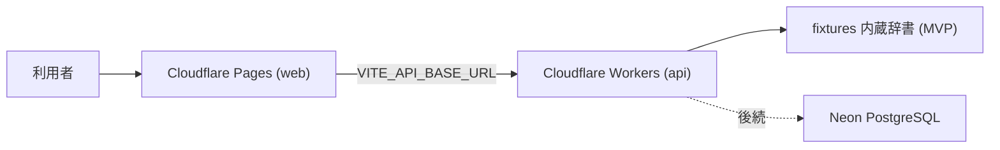

# 🚀 デプロイ・運用手順書（Deployment & Operations Runbook）

> 対象: Open BIM/CIM Dictionary Assistant MVP（fixtures ベース検索辞書）
> スタック: Cloudflare Workers (API) + Cloudflare Pages (Web) + Neon PostgreSQL（後続接続）
> ⚠️ **本番デプロイ・公開は人間（管理者）が手動で実行する。** CTO/AI は準備までを行い、実行しない。

---

## 📌 1. 構成サマリー

| 単位 | 実体 | デプロイ先 | 設定ファイル |
| --- | --- | --- | --- |
| API | `apps/api`（Hono / fixtures リポジトリ内蔵） | Cloudflare Workers | `apps/api/wrangler.toml` |
| Web | `apps/web`（React SPA） | Cloudflare Pages | ビルド出力 `apps/web/dist` + `_redirects` |
| DB | `migrations/0001_init.sql` | Neon PostgreSQL | 後続 Issue #12（プロジェクト作成は人間決裁） |



---

## ✅ 2. リリース前チェックリスト

デプロイ実行前に、すべて ✅ であることを確認する。

- [ ] main の CI（lint / typecheck / test / build / e2e / audit）が success
- [ ] `pnpm audit --audit-level high` が 0 件
- [ ] CodeRabbit レビューの Critical / High 指摘が 0 件
- [ ] README・本手順書が実装と一致
- [ ] `.env` / シークレットがリポジトリ・ログに含まれない（`git grep` 確認済み）
- [ ] migration up/down の round-trip 検証済み（§6 参照）
- [ ] ロールバック手順（§5）を読了・準備済み
- [ ] Cloudflare アカウントの権限・Wrangler ログイン確認（人間）

---

## 🔨 3. 初回デプロイ手順（人間が実行）

### 3.1 API — Cloudflare Workers

```bash
# 1) Cloudflare 認証（ブラウザが開く）
pnpm dlx wrangler@latest login

# 2) デプロイ（apps/api/wrangler.toml を使用）
cd apps/api
pnpm dlx wrangler@latest deploy

# 3) 動作確認
curl https://obcda-api.<ACCOUNT_SUBDOMAIN>.workers.dev/api/v1/health/live
curl "https://obcda-api.<ACCOUNT_SUBDOMAIN>.workers.dev/api/v1/search?q=IfcAlignment&limit=3"
```

環境変数（`wrangler.toml` の `[vars]` / シークレットは `wrangler secret put`）:

| 変数 | 用途 | 置き場所 |
| --- | --- | --- |
| `ALLOWED_ORIGIN` | Web からの CORS 許可 origin（Pages の URL） | vars |
| `DATABASE_URL` | Neon 接続文字列（後続 #12） | **secret のみ**（`wrangler secret put DATABASE_URL`） |
| `LLM_API_KEY` | AI 回答（後続 #14） | **secret のみ** |

### 3.2 Web — Cloudflare Pages

```bash
# 1) 本番 API の URL を指定してビルド
cd apps/web
VITE_API_BASE_URL=https://obcda-api.<ACCOUNT_SUBDOMAIN>.workers.dev pnpm build

# 2) Pages プロジェクト作成（初回のみ）+ デプロイ
pnpm dlx wrangler@latest pages project create obcda-web --production-branch main
pnpm dlx wrangler@latest pages deploy dist --project-name obcda-web

# 3) 動作確認（表示・検索・詳細遷移・原典リンク）
```

- SPA ルーティングは `apps/web/public/_redirects`（`/* /index.html 200`）で全パスを index.html へフォールバックする
- 検証段階では Cloudflare Access で Pages 全体を保護できる（Zero Trust → Access → Applications）

### 3.3 DB — Neon（後続 Issue #12・現時点では不要）

MVP は fixtures 内蔵のため DB なしで公開可能。Neon 接続時:

1. 🚫 **人間決裁**: Neon プロジェクト作成（推奨: `Open-BIM-CIM-Dictionary-Assistant` / `aws-ap-southeast-1` / PG17）
2. dev ブランチ作成 → `migrations/0001_init.sql` 適用 → 検証（pgvector 有効化含む）
3. 本番ブランチへの適用は人間承認後（`docs/` の変更管理に従う）
4. `wrangler secret put DATABASE_URL` で API へ接続情報を登録（値はチャット・ログへ出さない）

---

## 🔁 4. 更新デプロイ手順

1. リリース前チェックリスト（§2）を再確認
2. API: `cd apps/api && pnpm dlx wrangler@latest deploy`
3. Web: ビルド → `pnpm dlx wrangler@latest pages deploy dist --project-name obcda-web`
4. スモーク: `/api/v1/health/ready` 200・代表検索 1 件・詳細 1 件・Web トップ表示
5. 旧バージョン ID を記録（§5 ロールバックで使用）

---

## ⏪ 5. ロールバック手順

### 5.1 API（Workers）

```bash
# 直近のデプロイ一覧（version id を確認）
pnpm dlx wrangler@latest deployments list

# 指定バージョンへ戻す
pnpm dlx wrangler@latest rollback [--message "reason"]
```

### 5.2 Web（Pages）

Cloudflare ダッシュボード → Pages → obcda-web → Deployments → 対象デプロイの「Rollback to this deployment」。
（CLI: `wrangler pages deployment list --project-name obcda-web` で確認可能）

### 5.3 DB（Neon 接続後）

- 軽微なスキーマ戻し: `migrations/0001_init.down.sql`（**全データ破棄** — 本番では原則使用しない）
- 本番の復旧は **Neon のブランチ/PITR 復元**を正とする:
  1. 障害範囲と最終正常時点を特定
  2. 書き込み停止（メンテナンスモード）
  3. Neon コンソール/API で正常時点から新ブランチへ復元
  4. 整合性確認（件数・代表検索・監査連続性）
  5. `DATABASE_URL` シークレットを新ブランチへ切替（人間）
  6. 原因・影響・再発防止を記録

### 5.4 検証済み事項（2026-07-18）

- ✅ `0001_init.sql` → `0001_init.down.sql` → 再適用の round-trip をローカル PostgreSQL 16.14 で検証（テーブル 15→0→15、enum 完全削除・復元）
- ✅ CHECK 制約の実効性（期間逆転 INSERT の拒否）を確認
- 📝 **仮定/未検証**: `embeddings` テーブル（pgvector）はローカルに拡張が無いため未適用。Neon dev ブランチでの完全検証を #12 で実施する

---

## 📊 6. 運用・監視手順

| 項目 | 手段 | 目安 |
| --- | --- | --- |
| 死活監視 | `GET /api/v1/health/live` / `ready` | 200 以外でアラート |
| エラー率 | Workers Observability（`query_worker_observability`）| 5xx 率 5 分間 2% Warning / 5% Critical |
| ログ確認 | `wrangler tail` または Workers Logs（構造化 JSON） | requestId で相関 |
| 依存監査 | CI の audit ジョブ（毎 PR）+ 月次手動 `pnpm audit` | high+ 0 件維持 |
| 使用量 | Cloudflare ダッシュボード（Workers/Pages リクエスト数） | 無料枠逸脱前に通知 |

ログ方針（§12.1）: 生 IP・トークン・生プロンプト・エラー詳細メッセージは記録しない（errorName のみ）。

---

## 🚨 7. 障害対応手順

| 事象 | 一次対応 | 恒久対応 |
| --- | --- | --- |
| API 5xx 急増 | `wrangler tail` で errorName/requestId 確認 → 直近デプロイなら §5.1 ロールバック | 原因 Issue 化 → 修正 PR |
| Web 表示不能 | Pages Deployments で直近を Rollback（§5.2） | 同上 |
| DB 接続不能（接続後） | API は fixtures フォールバックなし→ `ready` 503 を確認し、Neon 状態確認（コンソール/ステータス） | §5.3 復元、接続リトライ設定見直し |
| bSDD 等外部 API 停止（取込後） | 取込ジョブのみ停止・辞書は最終同期データで継続（§11.3 設計） | アダプターのバックオフ確認 |
| LLM 停止（AI 実装後） | `AI_UNAVAILABLE` を返し検索は継続（設計 §11.3） | プロバイダー切替（アダプター） |
| シークレット漏えい疑い | 該当シークレットを即ローテーション（`wrangler secret put`）→ 影響調査 | 監査ログ確認・手順見直し |

---

## 🔐 8. セキュリティ運用

- シークレットは Cloudflare Secrets のみ（リポジトリ・ログ・チャット出力禁止）
- ローテーション: 四半期ごと、または漏えい疑い時に即時
- 依存更新: Dependabot 相当の監視は CI audit で代替中（強化は Issue 化）
- 管理系 API（/admin/*・後続）は Cloudflare Access 必須で公開経路と分離（設計 §9）

---

## 📝 9. 変更履歴

| 日付 | 版 | 内容 |
| --- | --- | --- |
| 2026-07-18 | 1.0 | 初版（MVP fixtures 構成のデプロイ・ロールバック・運用・障害対応） |
