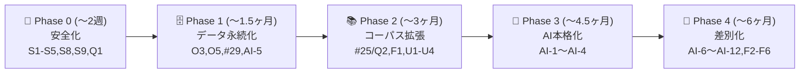

# 📋 プロジェクト包括評価レポート — Open BIM/CIM Dictionary Assistant

- 📅 評価日: 2026-08-04
- 🔖 評価対象: `main`（v0.3.0 + #38 AI設定/根拠付きAI回答、最終コミット `3da3db4`）
- 📏 規模: TS/TSX/SQL 約 11,400 行・7 ワークスペース（apps: api/web/ingestion、packages: contracts/db/domain/ui）
- 🧪 テスト: 15 ファイル・約 156 ケース + Playwright E2E 5 本、CI 3 ジョブ全通過
- 🎯 評価軸: ①機能デモ・UX ②セキュリティ・監査 ③コード品質・設計 ④運用・信頼性

---

## 📌 総合評価サマリー

| 評価軸 | 評点 | 一言評価 |
|---|---|---|
| 💻 コード品質・設計 | **A−** | 厳格 TS・port/adapter・単一情報源 enum など基盤は模範的。ただし neon.ts 未テスト・web 単体テスト 0 |
| 🖥️ 機能デモ・UX | **B−** | 9 画面が実 API で動くデモ導線は完結。ただし辞書 14 語・レスポンシブ欠如・一部モック残存 |
| 🔐 セキュリティ・監査 | **C** | SSRF 防御・入力検証・プロンプトインジェクション対策は優秀。**アプリ層認可ゼロ・APIキー平文保存・レート制限皆無**が重大 |
| ⚙️ 運用・信頼性 | **C+** | デプロイ手順書・ロールバック検証は誠実で高品質。**監視は紙上のみ・本番 DB 未適用・バックアップ演習ゼロ** |

**総評**: 「小さく正しく作られた MVP」。設計文書（要件定義書・詳細設計仕様書）との対応付けが徹底され、コード衛生は同規模 OSS の上位水準。一方で、**設計仕様書に定義済みで未実装の項目（認可・レート制限・IFC詳細・管理API・RAG・キャッシュ）が体系的に残っており**、"辞書" としての中身（14 概念・公式定義ゼロ・取り込み永続化なし）が製品価値のボトルネック。セキュリティは「エッジ（Cloudflare Access）一枚岩」で多層防御がない点が最大リスク。

---

## 🖥️ 1. 機能デモ・UX

### ✅ 強み

1. **デモ導線が一周する**: 検索「線形」→ IfcAlignment 詳細 → 関連概念 → 原典リンク → 比較（最大4件）→ 学習カード → AI質問 → 出典台帳 → 監査ログ CSV 出力 → AI キー設定、まで全て実 API で動作。
2. **9 画面 + サイドバーシェル**が統一デザイン（Claude Design dc 全面適用）で実装済み（`apps/web/src/pages/` 10 ページ）。
3. **根拠ファーストの AI UI**: 回答保留時も根拠カードを常に表示（`AiPage.tsx:150-157`）、注意書き 2 件を常時前置。意図的な「ヒットしない質問例（宇宙エレベーター）」を用意しており、"分からないと言える AI" をデモで示せる。
4. **日本語検索正規化が本物**: 3 層正規化（NFC/NFKC・中黒・長音符/ハイフン吸収・`compactFold`）で「線形」→ IfcAlignment、「IFC 4.3」≡「IFC4.3」が成立（`packages/domain/src/normalize.ts`）。一致理由（matchedBy）の可視化も良い。
5. **アクセシビリティ基礎が広く入っている**: セマンティックランドマーク、`role="search"/"status"/"alert"` 約 34 箇所、`aria-hidden` 装飾アイコン、`th scope`・`caption`、`fieldset/legend`、実 `<button>`/`<a>` のみでキーボード操作が素で成立。
6. **フィクスチャの質が高い**: 14 概念すべてに summaryJa・technicalNoteJa・よくある誤解・多言語ラベル・型付き関係（inherits/broader 等）。
7. 監査ログの CSV/HTML/PDF クライアント出力、比較バスケット、フラッシュカードなど細部の作り込み。

### ❌ 弱み

1. **辞書が 14 概念のみ・公式定義（officialDefinition）は全件 null**（再配布条件未確認のため）。Pset/Qto・別名（aliases）も空。製品価値の核が未充足。
2. **レスポンシブ実質ゼロ**: リポジトリ全体で Tailwind ブレークポイントは 1 箇所のみ（しかも未使用の packages/ui 内）。`w-[250px]` 固定サイドバー + `h-screen overflow-hidden` で、スマホ（375px）ではサイドバーが画面の 2/3 を占有。
3. **検索フィルタ・ページネーションの UI がない**: API 側は `family/type/schema` フィルタと `cursor` を実装済みなのに、UI から一切設定できない（`contracts/src/search.ts` vs 各ページ）。
4. **モック残存**: 出典画面の差分レビューキューは 3 件ハードコード（承認/却下もクライアント内のみ）、学習クイズは 5 問ハードコード。
5. **WCAG 2.4.7 違反**: `TextInput` が `outline-none` でフォーカスリングを消したまま代替なし（`apps/web/src/components/ui.tsx`）。全検索ボックスと API キー欄が対象。
6. **コントラスト不足**: `--color-faint: #8a97a8`（白地で約 3.0:1）を 11–12.5px の本文級テキストに使用（基準 4.5:1）。
7. IFC 詳細画面（SCR-04: 継承・属性・Pset/Qto）が**存在しない**（要件 FR-101〜105 未実装）。
8. AI 回答領域が live region でなく、送信後の回答がスクリーンリーダーに通知されない。skip-link なし。ダークモード・`prefers-reduced-motion` 対応なし。フォントは px 固定でブラウザ設定を無視。
9. UI は日本語ハードコードのみ（i18n フレームワークなし）。データモデルは多言語対応済みなのに UI が追いつかない。
10. 操作手順書（ユーザー向けマニュアル/デモシナリオ文書）が存在しない。docs/ は DEPLOYMENT.md の 1 ファイルのみ。

### 🔧 改善提案（優先順）

| # | 改善 | 規模 |
|---|---|---|
| U1 | 検索フィルタ UI（family/type/schema のセレクト + チップ表示）と「もっと見る」ページネーション | 小 |
| U2 | `TextInput`/ボタンに `focus-visible` リング復活 + faint 色を 4.5:1 以上へ（#6b7a8f 前後） | 極小 |
| U3 | サイドバーのモバイルドロワー化（`lg:` 境界 + ハンバーガー）と全ページの `sm:`/`md:` 対応 | 中 |
| U4 | レビューキュー・クイズの実データ化（#29 完了後）。それまで「サンプル」バッジを全モックに明示 | 小 |
| U5 | IFC 詳細画面の新設（`ifc_members`/`ifc_attributes` は DDL 済み。API+contracts+UI の縦一気通貫） | 大 |
| U6 | skip-to-content リンク、AI 回答の `aria-live="polite"` 化、axe 自動試験（#17） | 小 |
| U7 | `docs/USER_GUIDE.md` + デモシナリオ台本（5 分/15 分版）の整備 | 小 |
| U8 | 引用情報コピー機能（FR-009: 用語+版+出典 URL をワンクリックコピー） | 極小 |

---

## 🔐 2. セキュリティ・監査

### ✅ 強み

1. **SSRF 防御（ingestion）は模範実装**: HTTPS 限定・デフォルトポート限定・ホスト許可リスト・IP リテラル拒否・埋込認証情報拒否・**解決後アドレスの私設域チェック（IPv4/IPv6-mapped 全域）**・リダイレクト毎ホップ再検証（上限3）・ストリーミング容量上限・Content-Length/実測クロスチェック・マジックナンバー検査（`apps/ingestion/src/fetch/guard.ts`, `client.ts`）。TOCTOU 残余まで注記済み。
2. **入力検証は全エンドポイント Zod で統一・漏れなし**。SQL は Drizzle `sql` タグで全面パラメータ化、`sql.raw` なし。XSS 面は `dangerouslySetInnerHTML`/`innerHTML`/`eval` ゼロ。
3. **プロンプトインジェクション対策が水準以上**: 引用 ID を検索根拠集合と突合し、**未知 ID が 1 つでもあれば回答文ごと破棄**（claims だけでなく本文も信用しない設計判断。`assistant.ts:79-98`）。
4. **シークレット衛生**: リポジトリ内ハードコード秘密ゼロ、`.gitignore` 適切、ログは `error.name` のみ（生メッセージ/スタック排除）、API キーは旧 localStorage 設計を**能動的に掃除**するコードまである（`web/src/lib/settings.ts:38-41`）。GET は下4桁マスクのみ返却。
5. **CI サプライチェーン衛生**: `permissions: contents: read`・`persist-credentials: false`・frozen-lockfile・`pnpm audit --audit-level high` ジョブ・`onlyBuiltDependencies` 制限。
6. **監査ログのプライバシー設計**: クエリ文字列（検索語・AI質問）・IP・UA を意図的に記録しない。
7. CORS は完全一致関数方式（ワイルドカード/reflection なし）、credentials 無効。

### ❌ 弱み（重大度順）

1. 🚨 **アプリ層の認証・認可がゼロ**: `/api/v1/admin/*`（AI キー保存/削除/接続テスト）が公開読取系と同列にマウント（`app.ts:82`）。設計 §9.1 の Access JWT 検証（`CF_ACCESS_AUD` 等）は**宣言のみで一切未実装**。唯一の防御が Cloudflare Access で、既知のバイパス面（デプロイ毎 `<hash>.pages.dev` URL は Access も 301 も対象外）が state.json に残余リスクとして記録済み。→ その URL に到達できれば **無認証で API キーの差し替え/削除が可能**。
2. 🚨 **Anthropic API キーが Postgres に平文保存**（`aiSettings.ts:56-64`、`app_settings.value text`）。DB 読取・バックアップ・スナップショットのいずれからも生キーが回収可能。
3. 🚨 **インバウンドのレート制限が皆無**: 設計 §9.2 の 5 段階制限（検索 60/min 等）が全滅。`RATE_LIMITED` は使われない enum のみ。**トークン課金される `POST /assistant/answers`（max_tokens 4096・30s）が無制限**で、コスト増幅・DoS ベクトル。無認可の接続テスト API も `api.anthropic.com` へのオラクル/中継として使える。
4. ⚠️ **監査証跡が per-isolate インメモリ 500 件リングバッファ**（`auditLog.ts`）。isolate 破棄で消失、actor なし、改ざん耐性なし、保持ポリシーなし。`audit_events` テーブルは DDL 済みだが**書き込みコードがゼロ**。J-SOX/ISO の変更証跡として不成立（設計リリースチェックリスト §922 の「Access/RBAC/RateLimit/監査 確認済み」のうち 3 つが未実装）。
5. ⚠️ **HTML 文書にセキュリティヘッダが一切付かない**: `securityHeaders` ミドルウェアは強力（CSP `default-src 'none'`・HSTS 等）だが、Pages advanced mode では静的アセットは `env.ASSETS.fetch` 経由で**ミドルウェアを素通り**（`pages-worker.ts:44-48`）。`_headers` ファイルも meta CSP もなし。設計 §692 は CSP を XSS 主対策と定めている。
6. ⚠️ `REQUIRE_DATABASE="false"` のまま、かつ Pages 実運用では wrangler.toml の `[vars]` 自体が適用されない。本番はフィクスチャモードで稼働中。
7. Dependabot/Renovate なし、SAST/CodeQL なし、secret-scanning ワークフローなし、SBOM/署名なし（設計 §697 は Dependabot 相当+SBOM を要求）。
8. 環境変数の起動時 Zod 検証なし（設計 §15 違反）。`SOURCE_FETCH_ALLOWLIST`・`AI_LOG_RETENTION_DAYS`・`CF_ACCESS_*`・`LLM_PROVIDER` は**宣言されるが誰も読まない**設定ドリフト。
9. `ai_interactions` 未記録（FR-208 違反）→ AI 利用の追跡・コスト測定が不可能。

### 🔧 改善提案（優先順）

| # | 改善 | 内容 | 規模 |
|---|---|---|---|
| S1 | **Access JWT 検証ミドルウェア** | `/admin/*` に `CF_ACCESS_AUD`/`TEAM_DOMAIN` による JWT 検証（`jose` で JWKS 検証、Workers 互換）。未検証 401。多層防御の要 | 小〜中 |
| S2 | **API キーの暗号化保存** | Workers Secrets に KEK（`SETTINGS_ENC_KEY`）を置き、WebCrypto AES-GCM で `app_settings.value` を封筒暗号化。既存平文はマイグレーションで再暗号化 | 小 |
| S3 | **レート制限** | Cloudflare Workers Rate Limiting binding（`[[unsafe.bindings]]` or ダッシュボード WAF ルール）で §9.2 の 5 段階を実装。最低限 `/assistant/answers` 10 req/10min と `/admin/*` 20 req/min から | 小 |
| S4 | **監査ログの DB 永続化** | `audit_events` への Drizzle ライター実装 + `actor`（Access JWT の email クレーム）記録 + admin 変更の before/after summary。`c.executionCtx.waitUntil` で書込遅延を隠蔽 | 中 |
| S5 | **静的アセットへのヘッダ適用** | `apps/web/public/_headers` に CSP（`script-src 'self'` 等 SPA 用に調整）・HSTS・nosniff。または pages-worker で ASSETS 応答にヘッダ付与 | 極小 |
| S6 | Dependabot（週次・grouped）+ CodeQL + gitleaks の 3 ワークフロー追加 | | 小 |
| S7 | 起動時 env Zod 検証（`apps/api/src/env.ts` 新設）+ 死んだ env 変数の削除 or 実装 | | 小 |
| S8 | `REQUIRE_DATABASE=true` 化（Neon main スキーマ適用の人間ゲート通過後）と Pages 環境変数としての設定 | | 極小 |
| S9 | 全 `<hash>.pages.dev` への対策: pages-worker で Host ヘッダが正規ドメイン以外なら admin 系 404（正規化を 301 依存にしない） | 極小 |

---

## 💻 3. コード品質・設計

### ✅ 強み

1. **TypeScript 厳格性が全パッケージ均一**: `strict` + `noUncheckedIndexedAccess` + `noImplicitOverride` + `verbatimModuleSyntax` 等。緩和なし。
2. **`any` ゼロ・`@ts-ignore` ゼロ・TODO/FIXME ゼロ**。非 null アサーション全 6 箇所（うち 4 はテスト）。この規模で異例の衛生。
3. **設計文書との相互参照文化**: コード中に詳細設計仕様書の § 番号が密に引用され、「なぜ」が追える。DEPLOYMENT.md は失敗した代替案まで記録する誠実さ。
4. **port/adapter + DI が正しく機能**: `DictionaryRepository` 3 実装（inMemory/neon/unavailable）、`LlmProvider`、`IngestionRecorder`、`AiSettingsStore` すべて差し替え可能。ランキングは両バックエンド共有でパリティ担保。
5. **enum 単一情報源**: domain の `as const` タプル → Zod・Drizzle pgEnum 双方へ供給しドリフト構造的排除。
6. **DDL の質**: 17 enum・16 テーブル・生成列 tsvector(A/B/C/D 重み)+GIN・trgm・pgvector・広範な CHECK 制約・全 migration に down 対。
7. **LLM 劣化経路が全てテスト済み**: タイムアウト・不正 JSON・捏造引用・キー無しの各系統（`ai-settings.test.ts` 16 ケース）。ingestion の SSRF マトリクス 57 ケースも厚い。
8. domain の正規化・IFC 版パース（4X3/ADD2/TC1・令和/平成/昭和）・canonicalKey はカバレッジゲート 90% 付き。

### ❌ 弱み

1. 🐛 **バグ: `/system/info` が常に `"fixtures"` を返す**（`routes/system.ts:24` ハードコード）。Neon 接続時も UI トップバーと設定画面に「fixtures モード」と表示される。
2. **検索が DB 索引を使っていない**: `neon.ts` は `LIMIT 5000` で全候補を引いて **JS でスコアリング**。せっかくの tsvector GIN・trgm 索引が死蔵（#25）。5000 概念超で schema フィルタの取りこぼしが発生する正しさの崖 + O(n) スキャン。
3. **`neon.ts`（365 行）が完全に未テスト**: CI に DB がなく、版解決 CTE・ラベルフィルタ・getStats が自動検証されない。`packages/db` はテストスクリプト自体なし、schema.ts ↔ SQL の手動二重管理でドリフト検査なし（#16）。
4. **web の単体/コンポーネントテストがゼロ**（2,877 行が E2E 5 本のみ）。`lib/api.ts` のエラーマッピング・`lib/settings.ts` のサニタイズも未テスト。
5. **クライアントが API 応答を Zod 再検証しない**（`response.json() as T` キャスト）。contracts を web 側で使っておらず、契約破壊は実行時クラッシュで顕在化。
6. **ボイラープレート重複**: JSON parse→VALIDATION_ERROR→safeParse ブロックが 4 箇所コピペ、UUID 検証 3 箇所、`no-store` ヘッダ 9 箇所。ミドルウェア/ヘルパ未抽出。
7. **UI コンポーネント二重化**: `packages/ui`（6 コンポーネント）は web から **1 箇所も import されず**、web は独自 `components/ui.tsx`（9 コンポーネント）を使用。死んだ依存 + デザインドリフト源。
8. キャッシュ戦略が設計と真逆: 全ルート `no-store`・ETag なし（設計 §7.1/§11 は公開 GET のキャッシュ/ETag を要求）。原因は `meta.requestId` を応答本体に焼き込む構造。
9. カーソルが `\d{1,6}` 制限で 100 万超オフセットは黙って 1 ページ目へリセット。`compare.ts:40`・`neon.ts:292` の型アサーション。
10. カバレッジゲートが domain のみ（設計 §13.3 の API/Repo 80%・UI 75% は未計測）。turbo の `inputs/outputs` 未定義でキャッシュ粗い。

### 🔧 改善提案

| # | 改善 | 規模 |
|---|---|---|
| Q1 | `/system/info` の environment を実リポジトリ種別から返す（1 行修正 + テスト） | 極小 |
| Q2 | **検索 SQL 押し下げ（#25）**: 正規化 `version_label` 生成列 + tsvector/trgm を実際に使う WHERE/ランク式へ移行。in-memory 実装とのパリティテストを golden set で担保 | 中〜大 |
| Q3 | **DB 統合テスト**: CI に postgres サービスコンテナ（pgvector イメージ）+ migration 適用 + neon.ts 直接テスト + drizzle-kit ドリフト検査（#16） | 中 |
| Q4 | web に Vitest + Testing Library 導入（まず lib/・SettingsPage・AiPage の分岐から）。API 応答の Zod 検証を `lib/api.ts` に一元追加 | 中 |
| Q5 | `parseJsonBody<T>(schema)` ヘルパと `uuidParam` ミドルウェアで重複排除 | 小 |
| Q6 | packages/ui へ統合（web の ui.tsx を移管して import 切替）or packages/ui 廃止のどちらかに一本化 | 中 |
| Q7 | requestId をヘッダ専用にし公開 GET へ `Cache-Control: public, s-maxage` + ETag（コンテンツハッシュ） | 中 |
| Q8 | 起動時 env 検証（S7 と同一）・turbo inputs/outputs 定義・カバレッジゲートを api/ingestion にも展開 | 小 |

---

## ⚙️ 4. 運用・信頼性

### ✅ 強み

1. **DEPLOYMENT.md（260 行）が異例に誠実**: デプロイ履歴表（版・deployment ID・merge SHA・実行者）、失敗した代替案 2 件の記録、Access 化の経緯、環境変数表、コピペ可能な手順。
2. **ロールバック 3 系統が文書化**: Workers `wrangler rollback` / Pages ダッシュボード / DB は Neon ブランチ+PITR の 6 手順。**migration round-trip をローカル PG16 で実測検証済み**（15 テーブル→0→15、CHECK 制約の実効まで確認）。本番での down.sql 禁止を明記。
3. **live/ready 分離 + fail-closed**: `/health/ready` は 503 を返し分け、`REQUIRE_DATABASE=true` 時に DB なしなら安全側で全断（`unavailable.ts`）。
4. インシデント対応表 6 シナリオ（API 5xx/web 停止/DB 停止/bSDD 停止/LLM 停止/秘密漏えい）+ 監視しきい値定義（5xx 2%警告/5%重大）。
5. CI は format/lint/typecheck/test/build + E2E（失敗時 trace 保存）+ audit の 3 ジョブ、タイムアウト・並列キャンセル込み。
6. requestId 相関・Workers observability 有効化・人間ゲート規律（本番・秘密・スキーマは人間）。

### ❌ 弱み

1. 🚨 **アラートが 1 つも構成されていない**: しきい値は文書のみ。Cloudflare Notification も外形監視もなし。しかも Access 有効化後は未認証プローブが 302 になるため、**現在、本番の自動死活監視は存在しない**（Service Token 発行が残ゲートとして未了）。
2. 🚨 **本番 Neon main は空（スキーマ未適用）・fixtures モード稼働**。よって本番の辞書・監査ログ・AI 設定はすべて非永続。restore 演習も実施不能。
3. **スモークテストがコードとして存在しない**（過去の PASS 記録は手動 curl の散文）。デプロイ後検証が再現不能。
4. **バックアップは Neon PITR への参照のみ**: 保持期間・RPO/RTO・演習・pg_dump 等の Neon 外コピーが一切ない。Neon アカウント障害 = 全損。§5.3 の手順 2「メンテナンスモード」は**実装が存在しない**。
5. migration 適用の記録機構なし（schema_migrations なし・手動 psql）。`0002` はどこにも未適用のまま AI 設定コードが main に居る（fixtures モードでは in-memory ストアで動くため隠れている)。
6. エラーログが `error.name` のみで**本番デバッグ困難**（プライバシー方針とのトレードオフだが、requestId 付きスタックの別チャネル保存等の逃げ道がない）。
7. ingestion は手動 dry-run CLI のみ・DB 書込なし（#29）・cron なし。運用としての「辞書更新」がまだ運用不能。
8. オンコール/エスカレーション/重大度定義/ポストモーテムテンプレなし。SLO なし。負荷試験なし。ADR・SECURITY.md・CONTRIBUTING・PR/Issue テンプレなし。

### 🔧 改善提案

| # | 改善 | 規模 |
|---|---|---|
| O1 | **Access Service Token 発行（人間）→ 認証付き外形監視**: GitHub Actions cron（5 分毎）で `/health/live`・`/health/ready`・検索 1 件の 3 点スモーク。失敗時 Issue 自動起票 + 通知 | 小 |
| O2 | **`scripts/smoke.sh`（または smoke.test.ts）をコード化**し、デプロイ手順 §4 に組込み。O1 と同一スクリプトを共用 | 小 |
| O3 | Neon main へのスキーマ適用（人間ゲート）→ `DATABASE_URL` 登録 → `REQUIRE_DATABASE=true`。preview で restore 演習を 1 回実施し結果を DEPLOYMENT.md に記録 | 中（大半は人間作業） |
| O4 | 週次 `pg_dump` を GitHub Actions + R2 保存（暗号化）で Neon 外バックアップ。RPO/RTO を DEPLOYMENT.md に明記 | 小 |
| O5 | `schema_migrations` テーブル + 適用スクリプト（`scripts/migrate.ts`、drizzle-kit migrate でも可） | 小 |
| O6 | Cloudflare Notifications（5xx 率・CPU 超過）+ Workers Logs のエラーイベントに `requestId` 連携の stack 保存（logpush → R2、PII マスク付き） | 小 |
| O7 | ingestion の GitHub Actions 手動トリガ（workflow_dispatch）化 → 将来 cron。実行結果を `ingestion_runs` に記録（#29） | 中 |
| O8 | `docs/RUNBOOK.md`（オンコール・重大度・ポストモーテムテンプレ）、`SECURITY.md`、ADR ディレクトリ新設 | 小 |

---

## 🚀 5. おすすめ機能追加（AI 中心）

> 位置づけ: 「bSDD Search（buildingSMART 公式）+ IFC 4.3 仕様サイト + 汎用 AI チャット」の組合せに対する **80〜90% 代替**を目指す。差別化軸は ①日本語（BIM/CIM 要領含む）②根拠強制 AI ③横断検索の 3 点。以下は全て現行スタック（Workers/Neon/React）で実装可能なものに限定し、実現手順まで記す。

### 🤖 AI 機能（優先度順）

**AI-1. 本格 RAG — evidence_chunks + pgvector ハイブリッド検索（= 既存 #14）** 🔥最優先
- 現状: 質問を 200 字に切って**キーワード検索するだけ**。`embeddings`/`evidence_chunks` テーブルは DDL 済みで空。
- 実装: ① ingestion/seed 時に summaryJa・officialDefinition を 300〜500 字でチャンク化し `evidence_chunks` へ ② 埋め込みは Workers から呼べる Voyage AI（`voyage-3.5`、Anthropic 推奨）または Cloudflare Workers AI（`@cf/baai/bge-m3`、追加ベンダー不要・日本語可）③ `embeddings` に保存し HNSW 索引の migration 0003 を追加 ④ 検索は RRF（Reciprocal Rank Fusion）で FTS + ベクトルを融合 ⑤ `assistant.ts` の根拠取得をチャンク単位に置換し、引用 ID をチャンク ID 化（既存の引用検証ガードレールはそのまま活きる）。
- 効果: 「属性とプロパティは同じ？」のような**語彙が一致しない質問**に答えられるようになる。これが汎用 AI チャットとの体験差を埋める本丸。

**AI-2. ストリーミング回答（SSE）+ プロンプトキャッシュ**
- `llm.ts` の fetch に `stream: true`、Hono の `streamSSE` で中継、`AiPage` を逐次描画に。構造化 JSON はストリーム末尾でパース（`claims` は最終検証後に表示、本文のみ先行表示）。system prompt + evidence に `cache_control` を付け、連続質問のコストとレイテンシを削減。
- 効果: 体感速度が「汎用チャット並み」になる。max_tokens 4096 で最大 30 秒待ちの現状は代替品として致命的。

**AI-3. 自然文 → 検索条件変換（FR-201、tool use で実装）**
- Claude の tool use で `search_dictionary(q, family, type, schema)` をツール定義し、「IFC4.3 の道路系エンティティを教えて」→ `schema=IFC4.3, family=bsi_ifc` の構造化検索に変換。2〜3 ターンの agentic ループ（検索→根拠不足なら別条件で再検索）を `assistant.ts` に実装。既存の引用検証はループ最終出力に適用。
- 効果: フィルタ UI（U1）を作っても使わない層に、AI 経由でフィルタ検索の価値を届けられる。

**AI-4. 会話継続（マルチターン）+ AI 利用記録**
- `ai_interactions` テーブル（DDL 済み・未使用）に question/answer/引用チャンク ID/usage トークン数を記録（FR-208 充足）。会話 ID で直近 N ターンを文脈として送る。usage 集計で**コストダッシュボード**を設定画面に追加（レート制限 S3 の根拠データにもなる）。
- 効果: 「深掘り質問」体験 + 監査/コスト統制の同時達成。

**AI-5. 用語カード自動起草 → レビューキュー投入**
- bSDD 取り込み時、officialDefinition（英語）から `summaryJa`（やさしい日本語 50–100 字）・`technicalNoteJa`・`commonMisunderstanding` を Claude で自動起草し、**status=draft + review_tasks 起票**（テーブル DDL 済み）。人間がレビュー画面（現モックの実装化 = U4）で承認して published へ。Batch API を使えばコスト半減。
- 効果: **14 概念 → 数千概念への拡張を人手翻訳なしで実現**する唯一の現実解。「AI は起草・人間が承認」で品質方針（AI の推測を抑える）とも整合。

**AI-6. 版差分の AI 要約（FR-108 の実装形）**
- 同一 canonicalKey の concept_versions 間 diff を取り、「IFC4 → IFC4.3 で何が変わったか」を根拠付きで要約。比較画面に「版差分」タブ追加。
- 効果: 実務者の最頻出質問「この属性はどの版から？」に答える差別化機能。bSDD 公式にもない。

**AI-7. 取り込み品質チェック AI（quality_score 自動算出）**
- `quality_score` 列（DDL 済み・未使用）を、定義の欠落/矛盾/翻訳品質/関係の整合を Claude が 0–100 で採点して充足。閾値未満は review_tasks へ。ingestion runner の validate 段に組込み。

**AI-8. 説明レベル自動調整の拡張**
- 現在の beginner/technical 2 段を、ユーザー設定 + 質問文推定で「新人/現場/設計/研究」4 ペルソナ化。system prompt の rule 5 を差し替えるだけで実装小。学習画面のカード解説にも同レベルを適用。

**AI-9. クイズ・学習パス自動生成**
- ハードコード 5 問を廃し、published 概念からクイズを自動生成（正答根拠に evidenceId 必須のスキーマで生成 → 引用検証を通ったものだけ採用）。間違えた語の関連語（concept_relations）を次の出題に混ぜる適応学習。

**AI-10. 「このケースはどのエンティティ？」逆引き推薦**
- 「山岳トンネルの覆工をモデル化したい」→ 候補エンティティ + Pset を根拠付きで推薦。AI-1 の RAG があれば追加プロンプトのみで成立。IFC 詳細画面（U5）への導線に。

**AI-11. MCP サーバー化（辞書を AI エコシステムへ開放）**
- `search`/`concepts`/`compare` を MCP tool として公開する軽量 Worker を追加（`@modelcontextprotocol/sdk` は Workers で動作）。Claude Desktop / Claude Code 利用者が自分の AI から直接この辞書を引ける。
- 効果: 「他の公開土木 DX システム向け共通知識 API」という README の将来構想の最短実装。API 公開より認可設計が単純（読取専用 + トークン）。

**AI-12. 埋め込みベースの関連語マップ（可視化）**
- AI-1 の埋め込みを流用し、概念詳細に「意味的に近い用語」セクション + 2D マップ（UMAP 事前計算 → 静的 JSON）を追加。要件の「関連語マップ」を充足。

### 🧩 非 AI 機能

| # | 機能 | 根拠 |
|---|---|---|
| F1 | IFC 詳細画面（継承ツリー・属性・Pset/Qto）| 要件 FR-101〜105。bSDD/IFC docs 代替の必須条件。DDL 済み |
| F2 | 公開データエクスポート API（JSON/CSV、ライセンス状態フィルタ付き）| FR-308。研究者ペルソナの中核価値 |
| F3 | 管理 API 一式（取り込み開始/差分/承認/ロールバック）| FR-301〜307。§7.2 定義済み。現在 ai-settings のみ |
| F4 | PWA + オフライン学習カード | README 将来構想。Vite PWA plugin で小規模に開始可 |
| F5 | 検索結果の共有 URL（クエリ+フィルタの URL 同期）| 現在 state が URL に乗らない。実務共有で必須 |
| F6 | 英語 UI（i18n 基盤）| データは多言語設計済み。react-i18next で labels.ts を移行 |

---

## 🗺️ 6. 推奨ロードマップ（80〜90% 代替への道筋）

| フェーズ | 内容 | 完了条件（測定可能） |
|---|---|---|
| **P0 安全化**（即時〜2週） | S1 JWT検証・S2 キー暗号化・S3 レート制限・S5 _headers・S9 hash URL 対策・Q1 バグ修正・O1/O2 スモーク | admin 無認可アクセス不可・429 実装・外形監視稼働 |
| **P1 永続化**（〜1.5ヶ月） | Neon main 適用（人間）・migration runner・#29 DB 実記録・S4 監査永続化・O4 バックアップ | 本番 DB モード稼働・ingestion で概念が DB に入る・監査が消えない |
| **P2 コーパス**（〜3ヶ月） | #25 SQL 押し下げ・bSDD 全文取得・AI-5 自動起草+レビュー実装・F1 IFC 詳細・U1/U3 UI | **published 3,000+ 概念**・IFC 4.3 主要エンティティ網羅・モバイル閲覧可能 |
| **P3 AI 本格化**（〜4.5ヶ月） | AI-1 RAG・AI-2 ストリーミング・AI-3 検索変換・AI-4 会話+記録 | 語彙不一致質問の正答・初回トークン < 2 秒・コスト可視化 |
| **P4 差別化**（〜6ヶ月） | AI-6 版差分・AI-9 学習・AI-11 MCP・F2 エクスポート・F6 英語 UI | bSDD Search 対比の機能マトリクスで 80% 充足 |

**80〜90% 代替の判定基準（提案）**: ① bSDD Search の主要ユースケース（辞書横断検索・クラス/プロパティ詳細・URI 解決）② IFC 仕様サイトの参照ユースケース（エンティティ→属性→Pset 追跡）③ 汎用 AI チャットの Q&A 体験（自然文・追い질문・速度）— の 3 製品×主要タスクの充足率で四半期ごとに測定。本プロダクト固有の優位（日本語正規化・国交省要領の同居・根拠強制・引用検証）は代替でなく**上回り**要素として別掲する。

---

## 📎 付録: 主要指摘の根拠ファイル一覧

| 指摘 | 場所 |
|---|---|
| admin 無認可 | `apps/api/src/app.ts:82`、`middleware/context.ts:15-27` |
| APIキー平文保存 | `apps/api/src/services/aiSettings.ts:56-64`、`migrations/0002_ai_settings.sql` |
| レート制限欠如 | `middleware/errors.ts:13`（未使用 enum）、設計仕様書 §9.2 |
| 監査インメモリ | `apps/api/src/services/auditLog.ts:18-33`、`packages/db/src/schema.ts:426-440`（書込ゼロ） |
| HTML ヘッダ素通り | `apps/api/src/pages-worker.ts:44-48`、`_headers` 不在 |
| system/info 固定値バグ | `apps/api/src/routes/system.ts:24` |
| JS ランキングスキャン | `apps/api/src/repositories/neon.ts:32,98`（#25） |
| ingestion 非永続 | `apps/ingestion/src/pipeline/recorder.ts:50`（#29） |
| フォーカスリング喪失 | `apps/web/src/components/ui.tsx`（TextInput `outline-none`） |
| レスポンシブ欠如 | `apps/web/src/App.tsx`（`w-[250px]` 固定・ブレークポイント全リポジトリ 1 箇所) |
| 引用検証ガードレール（強み） | `apps/api/src/routes/assistant.ts:79-98` |
| SSRF 防御（強み） | `apps/ingestion/src/fetch/guard.ts`、`fetch/client.ts` |
